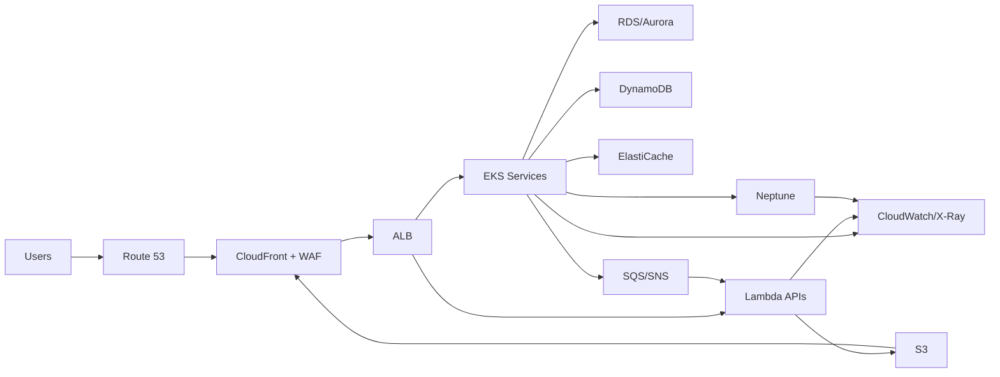

# Azure to AWS Architecture Migration - ADR and HLD

This document translates an existing Azure architecture to an equivalent AWS
architecture. It includes a service mapping, high-level design (HLD),
architecture decision records (ADRs) for each major flow, and a migration plan.

If any Azure components listed below do not match your environment, update the
assumptions and adjust the mapping and ADRs accordingly.

---

## 1. Scope and assumptions

Assumed Azure architecture:

- Edge and ingress: Azure DNS, Azure Front Door, Azure WAF, Application Gateway
- Compute: AKS for microservices, App Service for web APIs, Azure Functions
- Integration: Service Bus, Event Grid
- Data: Azure SQL Database or Azure Database for PostgreSQL (confirm which),
  Cosmos DB (Graph API under evaluation), Azure Blob Storage,
  Azure Cache for Redis
- Security: Azure AD, Key Vault, NSG, Azure Firewall, Azure Policy
- Observability: Azure Monitor, Application Insights, Log Analytics
- DevOps: Azure DevOps, Azure Container Registry

Non-functional requirements (baseline):

- Availability: 99.9%+ for critical APIs, multi-AZ in single region
- Latency: sub-200ms P95 for API responses on warm paths
- Security: least privilege, encryption in transit and at rest
- Compliance: centralized logging and audit trails retained 90+ days

Requirements driving migration (from stakeholder mail):

- UI improvements: chained connections visualization, labeled relationships,
  and relationship filtering.
- Search improvements: relational/graph traversal queries and higher-quality
  search results.
- Content recommendations: personalization and discovery, plus future
  traversal-based views (community detection and similarity).
- Functional requirements:
  - Workload is primarily analytical (OLAP) rather than purely transactional.
  - Labeled Property Graph (LPG) model preferred over RDF for flexibility.
  - Native graph data science library for algorithms in-engine.
  - In-memory analytics to project subgraphs for faster computation.
  - Vector search support for semantic similarity.

### 1.1 Existing flow (Azure) with internals (as-is)

Based on the provided architecture diagram and access control notes, the current
Azure flow can be summarized as follows. Update service names if your tenant
uses different SKUs or service names.

Actors and access:

- Users: Boeing employees and approved agency partners.
- Access path: Boeing network and/or VPN with SSO for read-only access.
- Admin users: limited Hivebrite personnel and designated Boeing roles.

Primary application flow (timeline and safety experience):

1. User accesses the Boeing portal page that embeds the Safety Experience
   (Hivebrite) application in an iframe.
2. Authentication occurs via Boeing SSO (Azure AD) with role-based access.
3. Requests traverse Azure Front Door (edge/CDN) and WAF for global entry and
   protection.
4. Application traffic routes to Azure App Service (API + web) or AKS.
5. App services read and write data to:
   - Cosmos DB Graph (timeline data in tree/graph structure; currently
     being evaluated for fit to avoid migration)
   - Azure SQL Database or Azure Database for PostgreSQL (transactional data)
   - Azure Blob Storage (static assets and media)
   - Azure Cache for Redis (caching, sessions)
   - Azure AI Search (search indexing and query relevance)
6. Secrets and certificates are pulled from Key Vault.
7. Observability is provided by Azure Monitor and App Insights.

Secondary flows (as shown in the diagram):

- Search experience is embedded in Hivebrite (iframe) and calls Azure-hosted
  APIs using SSO.
- Public RSS feed (FirstUp) is consumed by the app for content updates.
- Links to Boeing.com are gated by VPN/SSO policies.

### 1.2 Access control policy (current state)

- Boeing employees and selected agency partners authenticate via SSO.
- Read-only access is granted to standard users.
- Admin operations (config, user provisioning, auditing) are restricted to
  designated Boeing roles and Hivebrite super-admins.
- The application is SaaS-hosted by Hivebrite with tenant-specific access
  boundaries; Boeing integrates via SSO and network policy controls.

---

## 2. Target AWS architecture (summary)

The target architecture preserves the Azure patterns, favors managed services,
and keeps Kubernetes parity where AKS is used.

### Core design

- Multi-account landing zone using AWS Control Tower
- VPC per environment (dev, stage, prod) with public, private, and data subnets
- Edge and ingress with Route 53, CloudFront, WAF, and ALB
- EKS for containerized microservices; Lambda for event-driven workloads
- S3 for object storage; RDS/Aurora for relational; DynamoDB for NoSQL
- Neptune for timeline graph data and analytics (Neptune Analytics/ML)
- SQS/SNS and EventBridge for async integration
- Secrets Manager and KMS for secrets and encryption keys
- Observability with CloudWatch, X-Ray, and OpenSearch (optional)

### 2.1 Design changes (delta from Azure)

- Replace Cosmos DB Graph with Neptune for timeline graph data if Cosmos Graph
  does not meet traversal and analytics requirements.
- Introduce Neptune Analytics for OLAP graph algorithms and in-memory
  projections of subgraphs.
- Add vector similarity search for semantic discovery (Neptune ML/Analytics).
- Keep relational data in RDS/Aurora and NoSQL data in DynamoDB as needed.
- Update APIs to use Neptune traversals for relationships and path queries.
- Maintain Azure-style edge and ingress (Front Door/WAF -> CloudFront/WAF).
- Preserve iframe-based embedding and SSO flows with AWS equivalents.

### High-level flow (logical)

---

## 3. Azure to AWS service mapping with rationale

| Azure Service | AWS Service | Why this choice | Why not other options |
| --- | --- | --- | --- |
| Azure DNS | Route 53 | Managed DNS, health checks, weighted routing | Self-managed DNS adds ops overhead |
| Azure Front Door | CloudFront + WAF | Global edge, caching, WAF integration | Global Accelerator has no caching |
| Azure WAF | AWS WAF | Managed rules, integrates with CloudFront/ALB | Third-party WAF adds cost/complexity |
| Application Gateway | ALB | L7 routing, TLS, path-based rules | NLB is L4 only |
| AKS | EKS | Kubernetes parity, managed control plane | ECS lacks K8s API compatibility |
| App Service | ECS Fargate or Elastic Beanstalk | Simple managed app runtime | EC2 requires more ops, EKS overkill |
| Azure Functions | Lambda | Event-driven, native integrations | ECS tasks for long-running workloads |
| Service Bus | SQS/SNS | Managed queues and pub-sub | Amazon MQ for legacy protocols only |
| Event Grid | EventBridge | Event bus, schema registry, routing | SNS only covers simple fanout |
| Azure SQL Database | RDS/Aurora | Managed relational DB, HA | Self-managed DB on EC2 adds ops |
| Cosmos DB (Graph API) | Neptune | Purpose-built graph database with analytics | Cosmos Graph lacks built-in graph analytics |
| Cosmos DB (Core/SQL API) | DynamoDB | Managed NoSQL, scale, global options | DocumentDB has limited Mongo parity |
| Blob Storage | S3 | Durable object store, lifecycle policies | EFS not optimal for object storage |
| Azure Cache for Redis | ElastiCache (Redis) | Managed Redis, low latency | Self-managed Redis adds ops |
| Azure AD | IAM Identity Center / Cognito | SSO and user auth services | IAM users not for end-user auth |
| Key Vault | Secrets Manager + KMS | Managed secrets, rotation, HSM-backed keys | SSM alone lacks rotation workflows |
| Azure Monitor / App Insights | CloudWatch + X-Ray | Logs, metrics, tracing | Third-party only lacks AWS-native data |
| Log Analytics | CloudWatch Logs / OpenSearch | Centralized logs and search | DIY ELK requires management |
| NSG | Security Groups + NACLs | Instance and subnet controls | NACLs alone are too coarse |
| Azure Firewall | AWS Network Firewall | Managed network security | Self-managed firewalls add ops |
| Azure Policy | AWS Config + Control Tower | Guardrails and compliance | Custom scripts are brittle |
| Azure DevOps | GitHub Actions / CodePipeline | CI/CD integration with AWS | Self-managed CI lacks AWS controls |
| ACR | ECR | Managed container registry | Self-managed registry adds ops |

---

## 3.1 Neptune vs Cosmos analysis (graph workload)

Why Cosmos DB Graph is not fit for the timeline graph use case:

- Graph depth and traversal performance: Cosmos Graph is a multi-model system
  with Gremlin support, but deep traversals and complex path queries are not as
  optimized as a purpose-built graph database.
- Graph algorithms: Neptune Analytics provides built-in algorithms (centrality,
  community detection, similarity) for OLAP-style workloads, while Cosmos Graph
  typically requires external Spark jobs or custom pipelines.
- In-memory analytics: Neptune Analytics can project subgraphs for faster
  computation, which aligns with the stated OLAP requirements.
- Vector similarity search: Neptune supports vector similarity via Neptune
  ML/Analytics, while Cosmos requires Azure AI Search or custom vector services.
- Model preference: Neptune supports LPG natively (Gremlin) as well as RDF,
  aligning with the LPG preference stated in requirements.

Summary comparison (from the provided deck):

| Criteria | Neptune | Cosmos DB Graph |
| --- | --- | --- |
| Database type | Purpose-built graph database | Multi-model with graph API |
| Query model | LPG (Gremlin) + RDF (SPARQL) | LPG via Gremlin |
| Traversal performance | Optimized for deep graph traversals | Adequate but less optimized |
| Graph algorithms | Built-in via Neptune Analytics | Requires Spark/ETL pipelines |
| Vector search | Native support via Neptune ML/Analytics | Requires Azure AI Search |
| Best fit | Graph analytics, recommendations, similarity | Simple graph reads/writes |

---

## 3.2 Requirements to AWS design mapping (why AWS)

| Requirement from mail | AWS capability | Relevancy |
| --- | --- | --- |
| Chained connections visualization | Neptune traversals + API layer | Enables multi-hop path queries |
| Labeled relationships + filtering | LPG model with edge labels | Direct mapping to UI filters |
| Relational/graph search | Neptune Gremlin queries | Enables deep relationship search |
| Meaningful search results | Graph algorithms + vector similarity | Improves relevance and discovery |
| Personalization + recommendations | Neptune Analytics/ML | Supports similarity and ranking |
| OLAP workload | Neptune Analytics | Optimized for in-memory analytics |
| LPG model preference | Neptune LPG | Avoids RDF-only modeling overhead |
| Native graph data science | Neptune Analytics library | Minimizes external pipeline complexity |
| Vector search | Neptune ML/Analytics | Enables semantic similarity search |

---

## 4. HLD details

### 4.1 Network and security

- VPC per environment with 3 subnet tiers: public, private, data
- Public subnets host ALB and NAT Gateways
- Private subnets host EKS worker nodes, ECS tasks, Lambda ENIs
- Data subnets host RDS/Aurora and ElastiCache
- VPC endpoints for S3, DynamoDB, and Secrets Manager
- Security Groups enforce least privilege between tiers
- AWS WAF attached to CloudFront and ALB
- Centralized security via GuardDuty and Security Hub

### 4.2 Compute

- EKS is the primary platform for containerized services (AKS parity)
- ECS Fargate for simple web services that do not need Kubernetes
- Lambda for event-driven and short-lived tasks
- Auto scaling policies based on CPU, memory, and queue depth

### 4.3 Data

- RDS/Aurora for relational workloads requiring transactions
- DynamoDB for high-scale key-value or document workloads
- Neptune for timeline graph data (LPG) and OLAP analytics
- Neptune Analytics for graph algorithms; Neptune ML for vector search (optional)
- ElastiCache (Redis) for caching and distributed locks
- S3 for objects, static assets, and data lake
- Backups via AWS Backup with cross-region copies

### 4.4 Integration and async processing

- SQS for durable queues and worker decoupling
- SNS for fanout to multiple subscribers
- EventBridge for event routing and schema management
- Step Functions for multi-step workflows

### 4.5 Observability

- CloudWatch Logs and Metrics for infrastructure and apps
- X-Ray for distributed tracing
- Alarms routed through SNS to on-call channels
- Optional OpenSearch for log analytics

### 4.6 Identity and access

- IAM Identity Center for workforce SSO
- Cognito for end-user authentication when needed
- KMS for encryption keys; Secrets Manager for secret material

### 4.7 Graph and timeline data model (AWS)

- Timeline nodes and edges map to LPG vertices and edges.
- Tree-like structures are modeled as parent-child edges with labels such as
  "HAS_CHILD" and "HAS_PARENT" for directional traversal.
- Additional relationship edges (ownership, category, similarity) are
  represented with explicit edge labels for UI filtering.
- Traversal queries are executed in Neptune; analytics jobs run in Neptune
  Analytics for community detection and similarity scoring.

---

## 5. ADRs by flow

### ADR-001: Global entry and WAF

- Status: Proposed
- Context: Azure uses Front Door + WAF for global entry and protection.
- Decision: Use Route 53 + CloudFront + AWS WAF for global entry and caching.
- Alternatives:
  - Global Accelerator: no caching, higher cost for static assets.
  - API Gateway edge-optimized: not ideal for mixed static and dynamic content.
- Consequences:
  - Improved cache hit ratio for static assets.
  - Requires cache invalidation strategy for releases.

### ADR-002: L7 routing and service ingress

- Status: Proposed
- Context: Azure uses Application Gateway for L7 routing to AKS/App Service.
- Decision: Use ALB for HTTP routing into EKS/ECS/Lambda.
- Alternatives:
  - NLB: L4 only, no path routing or WAF integration.
  - API Gateway only: costlier for high-throughput internal routing.
- Consequences:
  - Consolidated routing at ALB with path and host rules.

### ADR-003: Kubernetes platform

- Status: Proposed
- Context: Workloads currently run on AKS with Kubernetes APIs.
- Decision: Use EKS to preserve Kubernetes parity.
- Alternatives:
  - ECS: simpler but no Kubernetes API; higher migration effort.
  - Self-managed K8s on EC2: higher operational overhead.
- Consequences:
  - Keeps deployment tooling and manifests largely compatible.

### ADR-004: Serverless compute

- Status: Proposed
- Context: Azure Functions are used for event-driven processing.
- Decision: Use AWS Lambda for serverless functions.
- Alternatives:
  - Fargate tasks: best for long-running workloads; slower to scale to zero.
  - EC2 workers: higher ops and cost at low utilization.
- Consequences:
  - Native integration with SQS/S3/EventBridge.

### ADR-005: Messaging and events

- Status: Proposed
- Context: Azure Service Bus and Event Grid are used for async flows.
- Decision: Use SQS/SNS and EventBridge.
- Alternatives:
  - Amazon MQ: only needed for legacy protocols (AMQP/JMS).
  - MSK (Kafka): higher ops for basic queueing patterns.
- Consequences:
  - Clear separation between queueing (SQS) and pub-sub (SNS).

### ADR-006: Relational data

- Status: Proposed
- Context: Azure SQL Database supports relational workloads.
- Decision: Use RDS or Aurora PostgreSQL.
- Alternatives:
  - Self-managed PostgreSQL on EC2: higher ops risk.
  - DynamoDB: not suitable for complex relational queries.
- Consequences:
  - Managed backups, Multi-AZ failover, read replicas.

### ADR-007: Graph database for timeline data

- Status: Proposed
- Context: Timeline graph data is stored in Cosmos DB (Graph API) and needs
  deep traversal, analytics, and similarity search. The data is hierarchical
  (tree-like) with cross-links that benefit from multi-hop traversal.
- Decision: Use Amazon Neptune (Neptune Database + Neptune Analytics/ML).
- Alternatives:
  - Cosmos DB Graph: lacks built-in graph algorithms and in-memory analytics.
  - Neo4j Aura: strong graph features but adds vendor/tooling changes.
  - JanusGraph on EC2: higher ops and scaling complexity.
- Consequences:
  - Enables LPG model, graph algorithms, and vector similarity search.
  - Requires data model and query migration to Neptune APIs.

### ADR-008: NoSQL data

- Status: Proposed
- Context: Cosmos DB (Core/SQL API) is used for non-graph NoSQL data.
- Decision: Use DynamoDB with global tables if needed.
- Alternatives:
  - DocumentDB: limited parity with MongoDB features.
  - Self-managed MongoDB: higher ops and patching costs.
- Consequences:
  - Predictable performance with partition key design.

### ADR-009: Object storage and CDN

- Status: Proposed
- Context: Blob Storage serves objects and static assets.
- Decision: Use S3 with CloudFront.
- Alternatives:
  - EFS: POSIX file system, not optimal for object delivery.
  - Origin directly from ALB: higher latency for static assets.
- Consequences:
  - Reduced origin load, better global latency.

### ADR-010: Secrets and encryption

- Status: Proposed
- Context: Azure Key Vault is used for secrets and keys.
- Decision: Use Secrets Manager for secrets and KMS for keys.
- Alternatives:
  - SSM Parameter Store only: lacks rotation workflows.
  - Storing secrets in code or config: security risk.
- Consequences:
  - Centralized secret rotation and audit trails.

### ADR-011: Observability

- Status: Proposed
- Context: Azure Monitor and App Insights provide logs and traces.
- Decision: Use CloudWatch + X-Ray + optional OpenSearch.
- Alternatives:
  - Third-party only: misses AWS native metrics.
  - Self-managed ELK: higher ops overhead.
- Consequences:
  - Unified metrics, logs, and traces in AWS-native tools.

---

## 6. Migration plan

### Phase 0: Discovery and readiness

- Inventory all Azure resources and dependencies
- Classify workloads by criticality and migration type (rehost, refactor)
- Identify data residency and compliance constraints
- Define success metrics and cutover criteria

### Phase 1: Landing zone and foundations

- Set up AWS Control Tower and accounts per environment
- Establish network topology, VPCs, and security guardrails
- Configure centralized logging, monitoring, and IAM SSO
- Set up CI/CD pipelines and container registries

### Phase 2: Data and integration migration

- Create target RDS/Aurora, DynamoDB, and S3 buckets
- Provision Neptune clusters and Neptune Analytics
- Export Cosmos Graph data and load to S3 (bulk loader format)
- Migrate graph schema, IDs, and edge labels to LPG model
- Validate traversal performance and analytics output
- Establish replication and migration pipelines (DMS, custom)
- Validate data integrity and performance baselines
- Stand up SQS/SNS/EventBridge with schema contracts

### Phase 3: Application migration (pilot first)

- Migrate a non-critical service to EKS or ECS as a pilot
- Migrate Azure Functions to Lambda
- Update service discovery, environment configs, and secrets
- Translate Gremlin queries and analytics jobs to Neptune equivalents
- Run performance and resiliency tests

### Phase 4: Incremental cutover

- Migrate remaining services by dependency order
- Use dual-write or sync jobs until Neptune data is verified
- Use read-replica strategies for relational data if needed
- Gradually shift traffic via Route 53 weighted routing
- Monitor error rates and rollback metrics

### Phase 5: Optimization and stabilization

- Right-size instances and scale policies
- Cost optimization (Savings Plans, caching, lifecycle rules)
- Post-migration review and ADR updates

---

## 7. Open questions

1. Which Azure services are actually in scope (confirm inventory)?
2. What are the current SLAs and SLO targets?
3. Is multi-region active-active required, or single-region with DR?
4. Are there any legacy protocols that require Amazon MQ or MSK?
5. What is the acceptable downtime window for cutover?
6. What is the exact relational store (Azure SQL vs Azure Database for PostgreSQL)?
7. What is the expected graph size and traversal depth for timeline queries?
8. Which graph algorithms and vector search use cases are in scope?

---

## 8. Pitfalls and advantages (Azure vs AWS)

| Area | Azure advantages | Azure pitfalls | AWS advantages | AWS pitfalls |
| --- | --- | --- | --- | --- |
| Graph DB | Cosmos Graph in same platform as other Azure services | Limited built-in analytics, external pipelines | Neptune purpose-built + analytics | Migration effort for Gremlin + data model |
| Cost model | Cosmos RU-based scaling with predictable limits | RU tuning can be complex for traversals | Neptune instance-based, can be cost effective for heavy traversals | Requires right-sizing + analytics capacity planning |
| Ops overhead | Azure managed services tightly integrated | Vendor-specific tooling | AWS managed services with strong ecosystem | More service choices to integrate |
| Analytics | Spark + Azure AI Search ecosystem | More data movement and pipeline ops | Neptune Analytics/ML for in-engine algorithms | New skillset for graph analytics tooling |
| Security | Azure AD integration | Cross-tenant SSO complexity | IAM Identity Center + Cognito options | Needs new IAM and VPC guardrails |

---

## 9. Future scope (post-migration)

- Graph-based recommendations and personalization using Neptune Analytics.
- Semantic search using embeddings and vector similarity.
- Community detection for new "relationship views" in the UI.
- Knowledge graph enrichment by integrating external data sources.
- Cross-account data products via Lake Formation and data sharing.
- Multi-region read replicas for low-latency global access.

---

## 10. POC scope and success criteria

POC goals:

- Validate Neptune traversal performance for timeline queries.
- Validate graph algorithms (centrality, similarity, community detection).
- Validate vector similarity search quality on sample data.
- Validate ingestion pipeline from Cosmos Graph to Neptune.
- Validate access control and SSO integration.

POC coverage checklist:

1. Data subset (10 to 20 percent of graph) exported from Cosmos Graph.
2. Bulk load to Neptune via S3 using bulk loader format.
3. Rebuild graph schema (vertex labels, edge labels, properties).
4. Implement top 5 traversal queries used by UI/search.
5. Run analytics (e.g., degree centrality, similarity, community).
6. Compare search relevance and latency against Cosmos baseline.
7. Measure compute and storage costs at POC scale.
8. Define success criteria (latency, relevance, cost per query).

---

## 11. Cost updates and comparison (driver-based)

Cost drivers (Azure Cosmos DB Graph):

- RU/s provisioning and autoscale limits
- Storage (GB-month) and backup retention
- Data transfer and multi-region replication
- External analytics pipeline (Spark/ETL) if used

Cost drivers (AWS Neptune):

- Neptune DB instance hours (writer + replicas)
- Storage (GB-month) and I/O
- Neptune Analytics compute hours for OLAP jobs
- S3 storage for bulk load and backups
- Data transfer and VPC endpoints

Cost comparison template (fill with actual metrics):

| Cost component | Azure Cosmos Graph (current) | AWS Neptune (target) | Notes |
| --- | --- | --- | --- |
| Provisioned capacity | RU/s tier and autoscale | Instance class and count | Align to P95 workload |
| Storage | Total GB-month | Total GB-month | Include indexes |
| Analytics | Spark/ETL job costs | Neptune Analytics hours | OLAP runs |
| Data transfer | Egress/replication | Egress/replication | Multi-region |
| Support/ops | Engineering time | Engineering time | Migration overhead |

Expected cost outcomes (directional):

- Lower operational overhead for graph analytics in AWS due to in-engine
  analytics instead of external Spark pipelines.
- More predictable query latency for multi-hop traversals with Neptune.
- Initial migration costs for data model and query translation.

