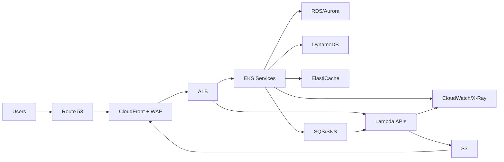

# Azure to AWS Architecture Migration - ADR and HLD

This document translates an existing Azure architecture to an equivalent AWS
architecture. It includes a service mapping, high-level design (HLD),
architecture decision records (ADRs) for each major flow, and a migration plan.

If any Azure components listed below do not match your environment, update the
assumptions and adjust the mapping and ADRs accordingly.

---

## 1. Scope and assumptions

Assumed Azure architecture:

- Edge and ingress: Azure DNS, Azure Front Door, Azure WAF, Application Gateway
- Compute: AKS for microservices, App Service for web APIs, Azure Functions
- Integration: Service Bus, Event Grid
- Data: Azure SQL Database, Cosmos DB, Azure Blob Storage, Azure Cache for Redis
- Security: Azure AD, Key Vault, NSG, Azure Firewall, Azure Policy
- Observability: Azure Monitor, Application Insights, Log Analytics
- DevOps: Azure DevOps, Azure Container Registry

Non-functional requirements (baseline):

- Availability: 99.9%+ for critical APIs, multi-AZ in single region
- Latency: sub-200ms P95 for API responses on warm paths
- Security: least privilege, encryption in transit and at rest
- Compliance: centralized logging and audit trails retained 90+ days

---

## 2. Target AWS architecture (summary)

The target architecture preserves the Azure patterns, favors managed services,
and keeps Kubernetes parity where AKS is used.

### Core design

- Multi-account landing zone using AWS Control Tower
- VPC per environment (dev, stage, prod) with public, private, and data subnets
- Edge and ingress with Route 53, CloudFront, WAF, and ALB
- EKS for containerized microservices; Lambda for event-driven workloads
- S3 for object storage; RDS/Aurora for relational; DynamoDB for NoSQL
- SQS/SNS and EventBridge for async integration
- Secrets Manager and KMS for secrets and encryption keys
- Observability with CloudWatch, X-Ray, and OpenSearch (optional)

### High-level flow (logical)

---

## 3. Azure to AWS service mapping with rationale

| Azure Service | AWS Service | Why this choice | Why not other options |
| --- | --- | --- | --- |
| Azure DNS | Route 53 | Managed DNS, health checks, weighted routing | Self-managed DNS adds ops overhead |
| Azure Front Door | CloudFront + WAF | Global edge, caching, WAF integration | Global Accelerator has no caching |
| Azure WAF | AWS WAF | Managed rules, integrates with CloudFront/ALB | Third-party WAF adds cost/complexity |
| Application Gateway | ALB | L7 routing, TLS, path-based rules | NLB is L4 only |
| AKS | EKS | Kubernetes parity, managed control plane | ECS lacks K8s API compatibility |
| App Service | ECS Fargate or Elastic Beanstalk | Simple managed app runtime | EC2 requires more ops, EKS overkill |
| Azure Functions | Lambda | Event-driven, native integrations | ECS tasks for long-running workloads |
| Service Bus | SQS/SNS | Managed queues and pub-sub | Amazon MQ for legacy protocols only |
| Event Grid | EventBridge | Event bus, schema registry, routing | SNS only covers simple fanout |
| Azure SQL Database | RDS/Aurora | Managed relational DB, HA | Self-managed DB on EC2 adds ops |
| Cosmos DB | DynamoDB | Managed NoSQL, scale, global options | DocumentDB has limited Mongo parity |
| Blob Storage | S3 | Durable object store, lifecycle policies | EFS not optimal for object storage |
| Azure Cache for Redis | ElastiCache (Redis) | Managed Redis, low latency | Self-managed Redis adds ops |
| Azure AD | IAM Identity Center / Cognito | SSO and user auth services | IAM users not for end-user auth |
| Key Vault | Secrets Manager + KMS | Managed secrets, rotation, HSM-backed keys | SSM alone lacks rotation workflows |
| Azure Monitor / App Insights | CloudWatch + X-Ray | Logs, metrics, tracing | Third-party only lacks AWS-native data |
| Log Analytics | CloudWatch Logs / OpenSearch | Centralized logs and search | DIY ELK requires management |
| NSG | Security Groups + NACLs | Instance and subnet controls | NACLs alone are too coarse |
| Azure Firewall | AWS Network Firewall | Managed network security | Self-managed firewalls add ops |
| Azure Policy | AWS Config + Control Tower | Guardrails and compliance | Custom scripts are brittle |
| Azure DevOps | GitHub Actions / CodePipeline | CI/CD integration with AWS | Self-managed CI lacks AWS controls |
| ACR | ECR | Managed container registry | Self-managed registry adds ops |

---

## 4. HLD details

### 4.1 Network and security

- VPC per environment with 3 subnet tiers: public, private, data
- Public subnets host ALB and NAT Gateways
- Private subnets host EKS worker nodes, ECS tasks, Lambda ENIs
- Data subnets host RDS/Aurora and ElastiCache
- VPC endpoints for S3, DynamoDB, and Secrets Manager
- Security Groups enforce least privilege between tiers
- AWS WAF attached to CloudFront and ALB
- Centralized security via GuardDuty and Security Hub

### 4.2 Compute

- EKS is the primary platform for containerized services (AKS parity)
- ECS Fargate for simple web services that do not need Kubernetes
- Lambda for event-driven and short-lived tasks
- Auto scaling policies based on CPU, memory, and queue depth

### 4.3 Data

- RDS/Aurora for relational workloads requiring transactions
- DynamoDB for high-scale key-value or document workloads
- ElastiCache (Redis) for caching and distributed locks
- S3 for objects, static assets, and data lake
- Backups via AWS Backup with cross-region copies

### 4.4 Integration and async processing

- SQS for durable queues and worker decoupling
- SNS for fanout to multiple subscribers
- EventBridge for event routing and schema management
- Step Functions for multi-step workflows

### 4.5 Observability

- CloudWatch Logs and Metrics for infrastructure and apps
- X-Ray for distributed tracing
- Alarms routed through SNS to on-call channels
- Optional OpenSearch for log analytics

### 4.6 Identity and access

- IAM Identity Center for workforce SSO
- Cognito for end-user authentication when needed
- KMS for encryption keys; Secrets Manager for secret material

---

## 5. ADRs by flow

### ADR-001: Global entry and WAF

- Status: Proposed
- Context: Azure uses Front Door + WAF for global entry and protection.
- Decision: Use Route 53 + CloudFront + AWS WAF for global entry and caching.
- Alternatives:
  - Global Accelerator: no caching, higher cost for static assets.
  - API Gateway edge-optimized: not ideal for mixed static and dynamic content.
- Consequences:
  - Improved cache hit ratio for static assets.
  - Requires cache invalidation strategy for releases.

### ADR-002: L7 routing and service ingress

- Status: Proposed
- Context: Azure uses Application Gateway for L7 routing to AKS/App Service.
- Decision: Use ALB for HTTP routing into EKS/ECS/Lambda.
- Alternatives:
  - NLB: L4 only, no path routing or WAF integration.
  - API Gateway only: costlier for high-throughput internal routing.
- Consequences:
  - Consolidated routing at ALB with path and host rules.

### ADR-003: Kubernetes platform

- Status: Proposed
- Context: Workloads currently run on AKS with Kubernetes APIs.
- Decision: Use EKS to preserve Kubernetes parity.
- Alternatives:
  - ECS: simpler but no Kubernetes API; higher migration effort.
  - Self-managed K8s on EC2: higher operational overhead.
- Consequences:
  - Keeps deployment tooling and manifests largely compatible.

### ADR-004: Serverless compute

- Status: Proposed
- Context: Azure Functions are used for event-driven processing.
- Decision: Use AWS Lambda for serverless functions.
- Alternatives:
  - Fargate tasks: best for long-running workloads; slower to scale to zero.
  - EC2 workers: higher ops and cost at low utilization.
- Consequences:
  - Native integration with SQS/S3/EventBridge.

### ADR-005: Messaging and events

- Status: Proposed
- Context: Azure Service Bus and Event Grid are used for async flows.
- Decision: Use SQS/SNS and EventBridge.
- Alternatives:
  - Amazon MQ: only needed for legacy protocols (AMQP/JMS).
  - MSK (Kafka): higher ops for basic queueing patterns.
- Consequences:
  - Clear separation between queueing (SQS) and pub-sub (SNS).

### ADR-006: Relational data

- Status: Proposed
- Context: Azure SQL Database supports relational workloads.
- Decision: Use RDS or Aurora PostgreSQL.
- Alternatives:
  - Self-managed PostgreSQL on EC2: higher ops risk.
  - DynamoDB: not suitable for complex relational queries.
- Consequences:
  - Managed backups, Multi-AZ failover, read replicas.

### ADR-007: NoSQL data

- Status: Proposed
- Context: Cosmos DB provides NoSQL and global replication.
- Decision: Use DynamoDB with global tables if needed.
- Alternatives:
  - DocumentDB: limited parity with MongoDB features.
  - Self-managed MongoDB: higher ops and patching costs.
- Consequences:
  - Predictable performance with partition key design.

### ADR-008: Object storage and CDN

- Status: Proposed
- Context: Blob Storage serves objects and static assets.
- Decision: Use S3 with CloudFront.
- Alternatives:
  - EFS: POSIX file system, not optimal for object delivery.
  - Origin directly from ALB: higher latency for static assets.
- Consequences:
  - Reduced origin load, better global latency.

### ADR-009: Secrets and encryption

- Status: Proposed
- Context: Azure Key Vault is used for secrets and keys.
- Decision: Use Secrets Manager for secrets and KMS for keys.
- Alternatives:
  - SSM Parameter Store only: lacks rotation workflows.
  - Storing secrets in code or config: security risk.
- Consequences:
  - Centralized secret rotation and audit trails.

### ADR-010: Observability

- Status: Proposed
- Context: Azure Monitor and App Insights provide logs and traces.
- Decision: Use CloudWatch + X-Ray + optional OpenSearch.
- Alternatives:
  - Third-party only: misses AWS native metrics.
  - Self-managed ELK: higher ops overhead.
- Consequences:
  - Unified metrics, logs, and traces in AWS-native tools.

---

## 6. Migration plan

### Phase 0: Discovery and readiness

- Inventory all Azure resources and dependencies
- Classify workloads by criticality and migration type (rehost, refactor)
- Identify data residency and compliance constraints
- Define success metrics and cutover criteria

### Phase 1: Landing zone and foundations

- Set up AWS Control Tower and accounts per environment
- Establish network topology, VPCs, and security guardrails
- Configure centralized logging, monitoring, and IAM SSO
- Set up CI/CD pipelines and container registries

### Phase 2: Data and integration migration

- Create target RDS/Aurora, DynamoDB, and S3 buckets
- Establish replication and migration pipelines (DMS, custom)
- Validate data integrity and performance baselines
- Stand up SQS/SNS/EventBridge with schema contracts

### Phase 3: Application migration (pilot first)

- Migrate a non-critical service to EKS or ECS as a pilot
- Migrate Azure Functions to Lambda
- Update service discovery, environment configs, and secrets
- Run performance and resiliency tests

### Phase 4: Incremental cutover

- Migrate remaining services by dependency order
- Enable dual-write or read-replica strategies if needed
- Gradually shift traffic via Route 53 weighted routing
- Monitor error rates and rollback metrics

### Phase 5: Optimization and stabilization

- Right-size instances and scale policies
- Cost optimization (Savings Plans, caching, lifecycle rules)
- Post-migration review and ADR updates

---

## 7. Open questions

1. Which Azure services are actually in scope (confirm inventory)?
2. What are the current SLAs and SLO targets?
3. Is multi-region active-active required, or single-region with DR?
4. Are there any legacy protocols that require Amazon MQ or MSK?
5. What is the acceptable downtime window for cutover?

