# 🤖 Autonomous Development Workflow - JARVIS Works While You're Busy

**Vision:** Delegate tasks to JARVIS anytime you're busy, return to completed PRs ready for review  
**Owner:** Deepak Rao Gaikwad (@deepakraog)  
**Version:** 1.1.0

---

## 🎯 The Vision

**JARVIS Works Anytime You're Busy:**

- **Anytime You're Busy:** Delegate tasks to JARVIS 📱
- **While You're Away:** JARVIS designs, implements, tests, creates PRs 🤖
- **When You Return:** Review completed PRs, provide feedback ✅
- **Your Time:** Merge approved PRs, focus on strategy 🚀
- **Continuous:** Use JARVIS 24/7 across multiple projects

**Use Cases:**
- 🌙 **Overnight:** Submit before bed, review in morning
- 🏢 **During Meetings:** Delegate during busy day, review after meetings
- ✈️ **While Traveling:** Submit from airport, review at destination
- 🏖️ **On Break:** Delegate before lunch/break, review when back
- 🎯 **Focused Work:** Delegate routine tasks while focusing on critical work

**Result:** Development continues 24/7 with you only involved in review and decision-making.

---

## 📱 STEP 1: SUBMIT TASKS - From Anywhere, Anytime

### Quick Submission via Any Device

**Using Cursor (Desktop/Mobile/Web):**

1. Open Cursor on any device
2. Choose repository
3. Start JARVIS (Cloud Agent)
4. Describe task clearly
5. Submit and continue with your day 🚀

**Mobile-Optimized Prompt Template:**

```
PROJECT: [App Name]
REPO: github.com/[org]/[repo]

FEATURE: [One-line description]

WHAT TO BUILD:
- [Bullet point 1]
- [Bullet point 2]
- [Bullet point 3]

SUCCESS CRITERIA:
- [When is this done?]
- [What should work?]
- [What are the requirements?]

TECH STACK: [Node.js, React, etc.]

AGENT INSTRUCTIONS:
Complete full development lifecycle:
1. Design (HLD + LLD + threat model)
2. Implementation (following SOLID, DRY principles)
3. Testing (80%+ coverage)
4. PR creation (comprehensive description)
5. Do NOT wait for approval - proceed autonomously
6. Notify when PR is ready for review

TIMELINE: Complete by morning (8 hours)
```

### Step 2: Set Notification Preferences

**Configure Webhook to Notify You:**

```bash
# Add webhook URL to automation
# Sends notification when PR is created

Webhook URL: https://your-notification-service.com/notify
OR
Email: your-email@example.com
OR
Slack: #pr-notifications channel
```

**What You'll Receive:**
- **Immediate:** "Agent started working on [Feature]"
- **Morning:** "PR #123 ready for review: [Feature Name]"
- **Summary:** Changes, tests, design decisions

---

## 🌙 NIGHT WORKFLOW - Agent Works Autonomously

### What Happens While You Sleep

```mermaid
gantt
    title Autonomous Development (8-hour night)
    dateFormat HH:mm
    axisFormat %H:%M
    
    section Design Phase
    Requirements Analysis      :00:00, 30m
    High-Level Design         :00:30, 45m
    Low-Level Design          :01:15, 45m
    Threat Model              :02:00, 30m
    
    section Implementation
    Setup & Dependencies      :02:30, 30m
    Core Implementation       :03:00, 120m
    Edge Cases & Polish       :05:00, 60m
    
    section Testing
    Unit Tests               :06:00, 45m
    Integration Tests        :06:45, 45m
    E2E Tests                :07:30, 30m
    
    section PR Creation
    Documentation            :08:00, 20m
    PR Description           :08:20, 20m
    Final Checks             :08:40, 20m
```



### Agent's Autonomous Steps

#### Phase 1: Design (1-2 hours)

**High-Level Design:**
- Problem statement
- Solution architecture
- Component breakdown
- Technology decisions
- Infrastructure changes

**Low-Level Design:**
- Detailed class diagrams
- Database schema
- API contracts
- State management
- Flow diagrams

**Threat Model:**
- Security considerations (STRIDE)
- Input validation strategy
- Authentication/authorization
- Data protection
- Rate limiting

**Output:** Design document committed to branch

#### Phase 2: Implementation (3-4 hours)

**Code Quality Standards Applied:**

```typescript
// Agent ensures ALL code follows these principles:

// 1. SOLID Principles
class UserService {  // Single Responsibility
  constructor(
    private readonly userRepo: UserRepository,  // Dependency Inversion
    private readonly emailService: EmailService
  ) {}
}

// 2. DRY Principle - No duplication
class Validator {
  static validateEmail(email: string): void {
    // Reusable validation
  }
}

// 3. Performance Optimized
async function getUsers() {
  // Parallel queries, not sequential
  const [users, posts] = await Promise.all([
    userRepo.findAll(),
    postRepo.findAll()
  ]);
}

// 4. Security First
async function login(email: string, password: string) {
  // Parameterized queries (no SQL injection)
  // Password hashing
  // Rate limiting applied
  // Input validation
}

// 5. Proper Error Handling
try {
  await riskyOperation();
} catch (error) {
  logger.error('Operation failed', { error, context });
  throw new ServiceError('User-friendly message');
}
```

**What Gets Built:**
- ✅ Clean, maintainable code
- ✅ SOLID principles applied
- ✅ DRY - no duplication
- ✅ Performance optimized (caching, async, etc.)
- ✅ Security hardened (no vulnerabilities)
- ✅ Type-safe (TypeScript strict mode)
- ✅ Properly formatted (Prettier/ESLint)
- ✅ Documented (JSDoc for complex logic)

#### Phase 3: Testing (1.5-2 hours)

**Comprehensive Test Suite:**

```typescript
// Unit Tests (60% of tests)
describe('UserService.register', () => {
  it('should create user with valid data', async () => { /* ... */ });
  it('should reject duplicate email', async () => { /* ... */ });
  it('should enforce password complexity', async () => { /* ... */ });
  it('should hash password before storing', async () => { /* ... */ });
});

// Integration Tests (30% of tests)
describe('POST /api/auth/register', () => {
  it('should return 201 with valid data', async () => { /* ... */ });
  it('should return 400 with invalid email', async () => { /* ... */ });
  it('should return 409 for duplicate user', async () => { /* ... */ });
});

// E2E Tests (10% of tests)
test('user can register and login', async ({ page }) => {
  // Full user journey
});
```

**Test Results:**
- ✅ All existing tests pass (no regressions)
- ✅ New tests added for new functionality
- ✅ Coverage: 85%+ (target: 80%+)
- ✅ Performance tests pass (API < 200ms)
- ✅ Security tests pass (no vulnerabilities)

#### Phase 4: PR Creation (30 minutes)

**Comprehensive PR Description:**

```markdown
## 🎯 Feature: User Authentication System

### Overview
Implemented complete authentication system with JWT tokens, 
password hashing, and refresh token support.

### Design Decisions
**High-Level Architecture:**
- JWT-based authentication (stateless)
- Redis for refresh token storage
- Bcrypt for password hashing (10 rounds)

**Why These Choices:**
- JWT: Scales horizontally, no server sessions
- Redis: Fast token lookup, automatic expiration
- Bcrypt: Industry standard, future-proof

### Changes Made
**New Files:**
- `src/services/auth.service.ts` - Authentication logic
- `src/controllers/auth.controller.ts` - API endpoints
- `src/middlewares/authenticate.ts` - JWT validation
- `tests/auth.service.test.ts` - Unit tests
- `tests/auth.integration.test.ts` - API tests

**Modified Files:**
- `src/index.ts` - Added auth routes
- `prisma/schema.prisma` - Added User model
- `package.json` - Added bcrypt, jsonwebtoken

### Security Considerations
✅ Passwords hashed with bcrypt (cost factor 10)
✅ JWT tokens signed with RS256
✅ Refresh tokens stored in Redis with expiration
✅ Rate limiting: 10 attempts per 15 minutes
✅ Input validation with Zod
✅ SQL injection prevention (parameterized queries)
✅ No sensitive data in logs

### Performance
- Login endpoint: 145ms average (target: <200ms) ✅
- Token validation: 8ms average (target: <50ms) ✅
- Database queries optimized with indexes
- Redis caching for token validation

### Testing
**Coverage:** 87% (target: 80%+) ✅

**Test Results:**
- Unit Tests: 24/24 passed ✅
- Integration Tests: 12/12 passed ✅
- E2E Tests: 5/5 passed ✅
- Performance Tests: All within limits ✅
- Security Scan: No vulnerabilities ✅

**Test Execution Time:** 12.4 seconds

### Database Migrations
```sql
-- Migration: 2024_07_21_001_create_users_table
CREATE TABLE users (
  id UUID PRIMARY KEY,
  email VARCHAR(255) UNIQUE NOT NULL,
  password_hash VARCHAR(255) NOT NULL,
  created_at TIMESTAMP DEFAULT NOW()
);
CREATE INDEX idx_users_email ON users(email);
```

### Breaking Changes
None. This is a new feature.

### Deployment Notes
**Required Environment Variables:**
- `JWT_SECRET` - RSA private key for signing tokens
- `JWT_PUBLIC_KEY` - RSA public key for verification
- `REDIS_URL` - Redis connection string

**Setup:**
1. Add environment variables to production
2. Run migration: `npm run migrate`
3. Restart application

### Screenshots
[If UI changes, agent includes screenshots]

### Next Steps
Suggested follow-ups (not blocking):
- [ ] Add OAuth2 providers (Google, GitHub)
- [ ] Implement 2FA
- [ ] Add password strength meter on frontend

---
**Agent:** Cursor Cloud Agent  
**Completed:** 7.5 hours  
**Branch:** cursor/feature/user-authentication-304b  
**Ready for Review:** Yes ✅
```

---

## ☀️ MORNING WORKFLOW - Your Review Process

### Step 1: Check Notifications (5 minutes)

**What You'll See:**

📧 **Email Notification:**
```
Subject: ✅ PR #42 Ready for Review: User Authentication System

Good morning! Your agent completed the User Authentication System.

PR: https://github.com/yourorg/repo/pull/42
Branch: cursor/feature/user-authentication-304b
Status: All checks passed ✅

Changes:
- 8 files changed, +1,247 additions
- Test coverage: 87%
- No security vulnerabilities
- All CI checks passed

Design Document: Available in PR description
Estimated Review Time: 15-20 minutes

Agent completed in 7.5 hours.
```

### Step 2: Quick Review (15-20 minutes per PR)

**Review Checklist:**

```markdown
## Design Review (5 minutes)
- [ ] Read HLD - does architecture make sense?
- [ ] Review LLD - are components well-designed?
- [ ] Check threat model - security concerns addressed?
- [ ] Verify design decisions - rationale clear?

## Code Review (10 minutes)
- [ ] Skim main implementation files
- [ ] Check SOLID principles applied
- [ ] Verify no code duplication (DRY)
- [ ] Look for obvious bugs or issues
- [ ] Check error handling
- [ ] Verify security (no hardcoded secrets, input validation)

## Testing Review (5 minutes)
- [ ] Coverage meets 80%+ threshold
- [ ] All tests passing
- [ ] Test cases cover edge cases
- [ ] No test anti-patterns

## Final Checks (2 minutes)
- [ ] Documentation updated
- [ ] No breaking changes (or properly documented)
- [ ] CI/CD pipeline passed
- [ ] Deployment notes clear
```

### Step 3: Provide Feedback (5 minutes)

**Option A: Approve & Merge** ✅
```bash
# Quick review, looks good
gh pr review 42 --approve --body "LGTM! Great work on security."
gh pr merge 42 --squash
```

**Option B: Request Changes** 🔄
```markdown
# Comment on PR
Great work overall! A few minor changes:

1. **Line 45:** Extract this validation into separate function
2. **Security:** Add rate limiting to password reset endpoint
3. **Tests:** Add test case for expired token scenario

Please update and I'll merge this afternoon.
```

**Option C: Iterate with Agent** 🤖
```markdown
# Start follow-up agent
Agent, please address these changes:
1. Add rate limiting to /auth/reset-password endpoint
2. Extract validation logic in auth.service.ts:45-67 to separate method
3. Add test case for expired token in auth.test.ts

Use the same branch and update the PR.
```

### Step 4: Plan Next Night (2 minutes)

**Queue Up Next Features:**

```markdown
# Submit before tonight's sleep

QUEUE FOR TONIGHT:
1. Feature: Password reset flow
2. Feature: Email verification
3. Refactor: Split auth service into smaller modules

PRIORITY: Complete in order, start next if time permits
```

---

## 🔄 CONTINUOUS AUTONOMOUS CYCLE

### Daily Pattern

```mermaid
gantt
    title 24-Hour Development Cycle
    dateFormat HH:mm
    axisFormat %H:%M
    
    section Your Day (16 hours)
    Wake Up & Review PRs      :09:00, 1h
    Merge Approved PRs        :10:00, 30m
    Work on Other Projects    :10:30, 7h
    Plan Evening Submissions  :17:30, 30m
    Submit Night Tasks        :22:00, 30m
    Sleep                     :22:30, 10h30m
    
    section Agent Night (8 hours)
    Task 1: Design           :22:30, 2h
    Task 1: Implementation   :00:30, 3h
    Task 1: Testing          :03:30, 2h
    Task 1: PR Creation      :05:30, 30m
    Task 2: Start if time    :06:00, 2h30m
```

### Weekly Velocity

**With This System:**
- **Per Night:** 2-3 features completed
- **Per Week:** 10-15 features completed
- **Your Time:** 2 hours/day (review only)
- **Agent Time:** 8 hours/night (implementation)

**Traditional Development:**
- **Per Week:** 3-5 features completed
- **Your Time:** 8 hours/day (all work)

**Result:** 3-5x productivity increase! 🚀

---

## 🎯 OPTIMIZATION STRATEGIES

### For Maximum Throughput

#### 1. Submit Multiple Tasks with Priorities

```markdown
# Night submission with 3 tasks

TASK 1 (PRIORITY: HIGH, EST: 6 hours):
Feature: User authentication
[Details...]

TASK 2 (PRIORITY: MEDIUM, EST: 4 hours):
Feature: Password reset
[Details...]
Dependencies: TASK 1 must complete first

TASK 3 (PRIORITY: LOW, EST: 3 hours):
Refactor: Split large service file
[Details...]
Start only if TASK 1 & 2 complete with time remaining
```

#### 2. Use Multiple Agents in Parallel

```markdown
# Start 3 agents simultaneously

AGENT 1: Work on Repository A (frontend)
AGENT 2: Work on Repository B (backend)
AGENT 3: Work on Repository C (mobile)

All work in parallel, wake up to 3 PRs!
```

#### 3. Enable Auto-Merge for Low-Risk Changes

```yaml
# In automation config
auto_merge:
  enabled: true
  conditions:
    - all_tests_pass: true
    - coverage_threshold: 80%
    - no_security_issues: true
    - change_type: ["docs", "tests", "refactor"]
  
# High-risk changes (features, fixes) still require review
```

#### 4. Set Up Quality Gates

```markdown
# Agent won't create PR unless:
- ✅ All tests pass
- ✅ Coverage ≥ 80%
- ✅ No linting errors
- ✅ Type checking passes
- ✅ Security scan clean
- ✅ Build succeeds
- ✅ Performance benchmarks met

If any fail, agent iterates until fixed
```

---

## 📊 TRACKING & METRICS

### Morning Dashboard

**What to Track:**

```markdown
## Daily Metrics (Auto-generated)

### Last Night (July 21 → 22, 2026)
**Tasks Submitted:** 3
**Tasks Completed:** 3 ✅
**PRs Created:** 3
**PRs Auto-Merged:** 1
**Awaiting Review:** 2

### Completion Details
1. ✅ User Authentication - 7.5 hours - PR #42
2. ✅ Password Reset - 4.2 hours - PR #43  
3. ✅ Code Refactoring - 2.8 hours - PR #44 (auto-merged)

### Quality Metrics
- Average Test Coverage: 86%
- Security Issues Found: 0
- Performance Regressions: 0
- Code Quality Score: 9.2/10

### Your Action Items
- Review PR #42 (est. 15 min)
- Review PR #43 (est. 10 min)
- Plan tonight's submissions
```

### Weekly Review

```markdown
## Week of July 15-21, 2026

**Features Completed:** 18
**Bugs Fixed:** 7
**Refactorings:** 5
**Total PRs:** 30
**Auto-Merged:** 12
**Your Review Time:** 12 hours (1.7 hours/day)
**Agent Development Time:** 56 hours (8 hours/night)

**Productivity Multiplier:** 4.7x
```

---

## 🛡️ SAFETY MECHANISMS

### Preventing Issues While You Sleep

#### 1. Change Size Limits

```yaml
# Agent won't proceed with changes exceeding limits
limits:
  max_files_changed: 15
  max_lines_added: 2000
  max_lines_deleted: 1000

# If exceeded, agent splits into multiple PRs
```

#### 2. Rollback on Critical Failures

```yaml
# If agent encounters critical issues
critical_failures:
  - production_tests_fail: true
  - security_vulnerability_high: true
  - build_breaks_main: true

# Action: Rollback changes, notify immediately
```

#### 3. Safe-Mode for New Agents

```markdown
# First 5 nights with new agent
safe_mode:
  enabled: true
  restrictions:
    - no_database_migrations: true
    - no_infrastructure_changes: true
    - no_security_changes: true
    - require_review: true

# Once confident, disable safe mode
```

#### 4. Notification Thresholds

```yaml
# Notify immediately (even at night) if:
immediate_alerts:
  - agent_blocked_over: 2 hours
  - critical_error_encountered: true
  - production_issue_detected: true
  - security_vulnerability_critical: true

# Otherwise, morning summary is fine
```

---

## 🎓 BEST PRACTICES

### For Optimal Results

#### 1. Clear, Detailed Requirements

❌ **Bad (Ambiguous):**
```
Add user login
```

✅ **Good (Detailed):**
```
FEATURE: User Login with JWT

REQUIREMENTS:
- Email + password authentication
- JWT access token (1 hour expiry)
- Refresh token (7 days expiry)
- Password complexity: 8+ chars, 1 uppercase, 1 number
- Rate limiting: 10 attempts per 15 minutes
- Secure password hashing (bcrypt)

SUCCESS CRITERIA:
- User can log in with valid credentials
- Invalid credentials return 401
- Token refresh works correctly
- Rate limiting prevents brute force
- All tests pass with 80%+ coverage
```

#### 2. Prioritize Independent Tasks

✅ **Good (Can run in parallel):**
```
TASK 1: User authentication (backend)
TASK 2: Profile page UI (frontend)
TASK 3: Email service setup (infrastructure)

All independent, can be done by 3 agents simultaneously
```

❌ **Bad (Sequential dependencies):**
```
TASK 1: Database schema
TASK 2: API endpoints (depends on TASK 1)
TASK 3: Frontend (depends on TASK 2)

Must run sequentially, slower
```

#### 3. Provide Context

**Always Include:**
- Existing patterns in codebase
- Preferred libraries/frameworks
- Architecture constraints
- Related PRs or issues
- Design preferences

```markdown
CONTEXT:
- We use Prisma for database (see src/db/prisma.ts)
- Auth pattern: JWT with refresh tokens (see existing users service)
- Error handling: Custom error classes in src/errors/
- Testing: Jest for unit, Supertest for integration
- Code style: Follow existing patterns in src/services/
```

#### 4. Review & Iterate

**First Few Nights:**
- Review thoroughly
- Provide detailed feedback
- Teach agent your preferences

**After Calibration:**
- Quick reviews (10-15 min)
- Auto-merge low-risk changes
- Focus on high-level decisions

---

## 🚀 SCALING TO MULTIPLE PROJECTS

### Managing 5-10 Projects Simultaneously

```markdown
## Monday Night Submissions

PROJECT 1 (E-commerce Platform):
- Agent A: Implement shopping cart
- Agent B: Add payment integration
- Agent C: Update product search

PROJECT 2 (SaaS Dashboard):
- Agent D: Build analytics charts
- Agent E: Add user permissions

PROJECT 3 (Mobile App):
- Agent F: Implement push notifications

PROJECT 4 (API Service):
- Agent G: Optimize database queries

Tuesday Morning:
- Review 7 PRs (90 minutes)
- Merge approved changes
- Plan next night
```

### Dedicated Agents per Project

```markdown
# Configure project-specific agents

PROJECT: E-commerce Platform
AGENT: ecommerce-agent
PREFERENCES:
  - Framework: Next.js 14
  - Database: PostgreSQL
  - Testing: Vitest + Playwright
  - Code style: Airbnb

PROJECT: Mobile App
AGENT: mobile-agent
PREFERENCES:
  - Framework: React Native
  - State: Redux Toolkit
  - Testing: Jest + Detox
```

---

## 💡 SUCCESS STORIES

### Real-World Example

**Day 1: Monday Night**
```
22:00 - Submit 3 tasks from phone
22:30 - Go to sleep
```

**Night Activity:**
```
22:30 - Agent starts Task 1: User Auth
02:45 - Task 1 complete, PR #42 created
03:00 - Agent starts Task 2: Password Reset
05:30 - Task 2 complete, PR #43 created
05:45 - Agent starts Task 3: Email Verification
07:45 - Task 3 complete, PR #44 created
```

**Day 2: Tuesday Morning**
```
08:00 - Wake up to 3 completed PRs
08:15 - Review PR #42 (15 min) - Approve ✅
08:30 - Review PR #43 (10 min) - Request minor changes
08:40 - Review PR #44 (8 min) - Auto-merged ✅
08:50 - Comment on PR #43 with changes
09:00 - Start regular work day
```

**Tuesday Afternoon:**
```
14:00 - Agent completes PR #43 updates
14:15 - Quick review (5 min) - Approve ✅
14:20 - All tasks from last night merged!
```

**Productivity:**
- **Features Completed:** 3
- **Your Time:** 38 minutes (review only)
- **Agent Time:** 9 hours (overnight)
- **Traditional Time:** Would take 3+ days of full-time work

---

## 🎯 YOUR ACTION PLAN

### Week 1: Setup & Calibration

**Day 1-2:**
- [ ] Review all documentation
- [ ] Set up first automation
- [ ] Submit 1 small task before sleep
- [ ] Review in morning, provide detailed feedback

**Day 3-4:**
- [ ] Submit 2 tasks before sleep
- [ ] Review patterns agent follows
- [ ] Adjust templates based on results

**Day 5-7:**
- [ ] Submit 3 tasks before sleep
- [ ] Enable auto-merge for low-risk changes
- [ ] Scale to multiple projects

### Week 2: Optimization

**Goals:**
- [ ] Consistent 3 PRs per night
- [ ] Review time under 1 hour/morning
- [ ] Auto-merge rate >40%
- [ ] Add 2-3 more projects

### Week 3+: Full Velocity

**Goals:**
- [ ] 5-10 projects running simultaneously
- [ ] 10-15 PRs per week
- [ ] Review time 1-2 hours/day
- [ ] True 24/7 development velocity

---

## 📞 EMERGENCY PROCEDURES

### If Something Goes Wrong

**Agent Stuck/Blocked:**
```
1. Check notification/email for agent status
2. Review agent transcript at cursor.com/agents
3. Provide clarification or unblock
4. Agent resumes automatically
```

**Bad PR Created:**
```
1. Close PR
2. Provide feedback on what went wrong
3. Agent learns and improves
4. Resubmit task with clearer requirements
```

**Critical Production Issue:**
```
1. Immediate alerts configured (see Safety Mechanisms)
2. Rollback changes if needed
3. Agent creates hotfix PR
4. Fast-track review process
```

---

## 🎉 BENEFITS SUMMARY

**What You Gain:**

✅ **24/7 Development:** Work continues while you sleep  
✅ **3-5x Productivity:** More features in less time  
✅ **Work-Life Balance:** Focus on high-value tasks  
✅ **Scalability:** Handle 5-10 projects simultaneously  
✅ **Consistency:** SOLID principles, DRY, best practices always applied  
✅ **Quality:** 80%+ test coverage, security-first approach  
✅ **Documentation:** Comprehensive design docs for every change  

**What You Keep:**
- ✅ Final decision-making power
- ✅ Code review and quality control
- ✅ Strategic direction
- ✅ Architecture decisions

---

**Your development team now works 24/7. You just review and guide. Welcome to autonomous development! 🚀**

---

**Version:** 1.0.0  
**Last Updated:** July 21, 2026  
**Owner:** Deepak Rao Gaikwad (@deepakraog)
