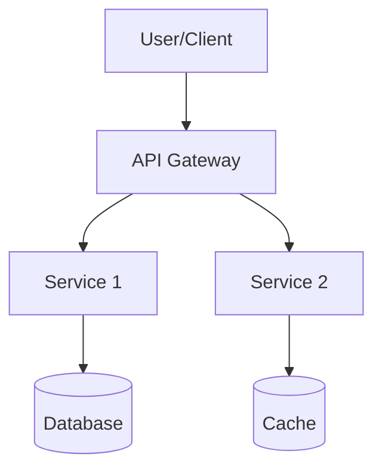
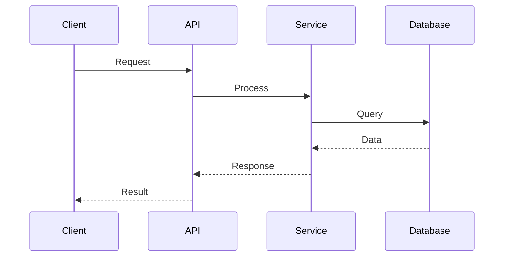
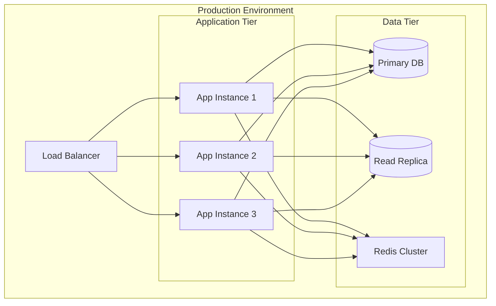
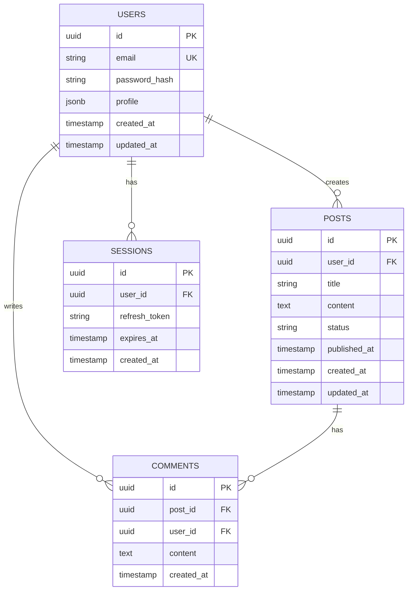
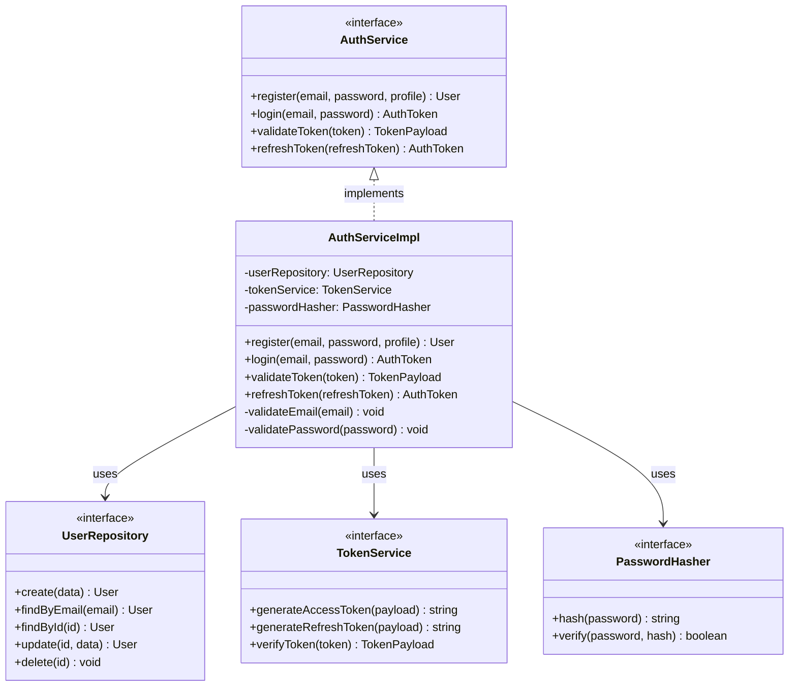
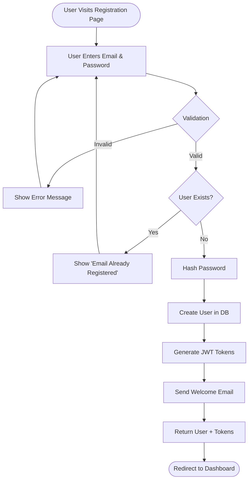
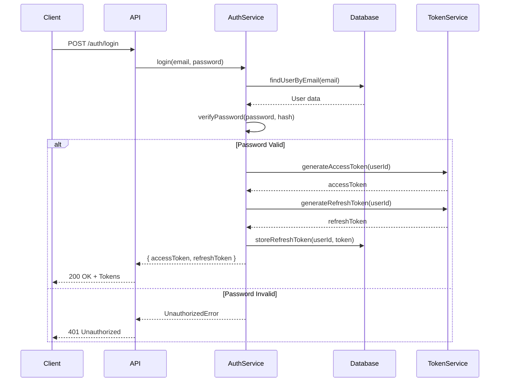
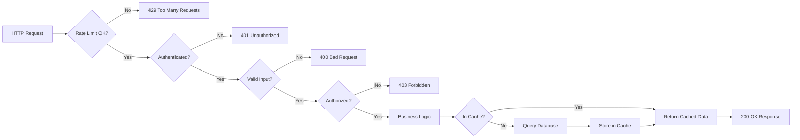

# 🏗️ Design Phase Template for Cursor Cloud Agents

**Purpose:** Comprehensive design documentation before implementation  
**Owner:** Deepak Rao Gaikwad (@deepakraog)  
**Version:** 1.0.0

---

## 📋 Overview

This template ensures thorough design and architectural planning before any code changes. Agents should complete this phase for all non-trivial changes (new features, refactoring, infrastructure changes).

---

## 1️⃣ HIGH-LEVEL DESIGN (HLD)

### 1.1 Problem Statement

**What problem are we solving?**
[Clear description of the business/technical problem]

**Why is this important?**
[Business value, user impact, technical debt, performance issues]

**Current State:**
- What exists today
- Pain points and limitations
- Metrics (if applicable): response time, error rate, user complaints

**Desired State:**
- What we want to achieve
- Success metrics
- Timeline constraints (if any)

---

### 1.2 Proposed Solution Overview

**High-Level Approach:**
[Brief description of the solution strategy]

**Key Components:**
1. Component A - [Purpose]
2. Component B - [Purpose]
3. Component C - [Purpose]

**System Context Diagram:**


**Data Flow:**


---

### 1.3 Architecture Decisions

**Architectural Style:**
- [ ] Monolithic
- [ ] Microservices
- [ ] Serverless
- [ ] Event-Driven
- [ ] Layered
- [ ] Hexagonal/Clean Architecture
- [ ] Other: __________

**Key Decisions:**

| Decision | Options Considered | Chosen Option | Rationale |
|----------|-------------------|---------------|-----------|
| Database | PostgreSQL, MongoDB, DynamoDB | PostgreSQL | ACID compliance required for transactions |
| API Style | REST, GraphQL, gRPC | REST | Simple CRUD operations, wide client support |
| Caching | Redis, Memcached, In-memory | Redis | Pub/sub needed for real-time updates |
| Authentication | JWT, OAuth2, Sessions | JWT | Stateless, works well with microservices |

---

### 1.4 Technology Stack

**New Project:**
```yaml
Backend:
  Language: TypeScript (Node.js 20+)
  Framework: Express / Fastify / NestJS
  ORM: Prisma / TypeORM
  Validation: Zod / Joi
  
Frontend:
  Language: TypeScript
  Framework: React 18+ / Next.js 14+
  State: Zustand / Redux Toolkit
  Styling: Tailwind CSS
  
Database:
  Primary: PostgreSQL 16+
  Cache: Redis 7+
  
Infrastructure:
  Cloud: AWS / GCP
  Containers: Docker
  Orchestration: Kubernetes / ECS
  IaC: Terraform
  
Observability:
  Logging: Winston / Pino
  Monitoring: Datadog / Prometheus
  Tracing: OpenTelemetry
  
CI/CD:
  Pipeline: GitHub Actions
  Testing: Jest, Playwright
  Quality: SonarQube
```

**Existing Project:**
```yaml
Current Stack:
  Backend: Node.js 18, Express
  Frontend: React 17
  Database: PostgreSQL 14
  
Additions/Changes:
  - Upgrade Node.js 18 → 20 (LTS)
  - Add Redis for caching
  - Introduce TypeScript (gradual migration)
  - Add OpenTelemetry for tracing
  
Migration Strategy:
  Phase 1: Add new components in TypeScript
  Phase 2: Migrate critical paths
  Phase 3: Full migration
```

---

### 1.5 Infrastructure Architecture

**Deployment Architecture:**


**Infrastructure Changes:**

| Component | Current | Proposed | Reason |
|-----------|---------|----------|--------|
| Compute | EC2 t3.medium | ECS Fargate | Better scaling, lower management |
| Database | Single RDS instance | Multi-AZ with replica | High availability |
| Cache | None | ElastiCache Redis | Reduce DB load |
| CDN | None | CloudFront | Static asset delivery |

**Scaling Strategy:**
- Horizontal scaling for application tier (target: 70% CPU)
- Vertical scaling for database (monitor IOPS)
- Auto-scaling rules: min 2, max 10 instances
- Database connection pooling (max 100 connections per instance)

---

### 1.6 Performance Considerations

**Target Metrics:**

| Metric | Current | Target | Improvement |
|--------|---------|--------|-------------|
| API Response Time (p95) | 800ms | 200ms | 75% reduction |
| Database Query Time (p95) | 500ms | 50ms | 90% reduction |
| Page Load Time (FCP) | 3.2s | 1.5s | 53% reduction |
| Throughput | 100 req/s | 1000 req/s | 10x increase |
| Error Rate | 2.5% | <0.1% | 96% reduction |

**Optimization Strategies:**
1. **Caching:** Redis for frequently accessed data (TTL: 5 minutes)
2. **Database:** Indexes on `user_id`, `created_at`, composite indexes
3. **API:** Implement pagination (max 100 items per page)
4. **Frontend:** Code splitting, lazy loading, image optimization
5. **Network:** Enable gzip compression, HTTP/2

---

### 1.7 Capacity Planning

**Expected Load:**
- Current Users: 10,000 MAU
- Expected Growth: 50% YoY
- Peak Traffic: 3x average (during business hours)

**Resource Requirements:**

```yaml
Application Tier:
  Normal: 3 instances (2 vCPU, 4GB RAM each)
  Peak: 10 instances
  
Database:
  Instance: db.r6g.xlarge (4 vCPU, 32GB RAM)
  Storage: 500GB SSD (IOPS: 3000)
  Connections: 300 max
  
Cache:
  Instance: cache.r6g.large (2 vCPU, 13GB RAM)
  Memory: 10GB data + 3GB overhead
```

**Cost Estimate:**
- Compute: $500/month (normal), $1,200/month (peak)
- Database: $600/month
- Cache: $150/month
- Storage: $50/month
- **Total:** ~$1,300/month normal, ~$2,000/month peak

---

## 2️⃣ LOW-LEVEL DESIGN (LLD)

### 2.1 Component Design

**Component: User Authentication Service**

**Responsibilities:**
- User registration and login
- JWT token generation and validation
- Password hashing and verification
- Session management

**Interface:**
```typescript
interface AuthService {
  // User registration
  register(email: string, password: string, profile: UserProfile): Promise<User>;
  
  // User login
  login(email: string, password: string): Promise<AuthToken>;
  
  // Token validation
  validateToken(token: string): Promise<TokenPayload>;
  
  // Token refresh
  refreshToken(refreshToken: string): Promise<AuthToken>;
  
  // Password reset
  requestPasswordReset(email: string): Promise<void>;
  resetPassword(token: string, newPassword: string): Promise<void>;
}

interface User {
  id: string;
  email: string;
  profile: UserProfile;
  createdAt: Date;
  updatedAt: Date;
}

interface AuthToken {
  accessToken: string;
  refreshToken: string;
  expiresIn: number;
}

interface TokenPayload {
  userId: string;
  email: string;
  roles: string[];
  iat: number;
  exp: number;
}
```

**Implementation Details:**
```typescript
// SOLID Principles Applied:
// - Single Responsibility: Each class has one reason to change
// - Open/Closed: Extensible through interfaces
// - Liskov Substitution: Implementations can be swapped
// - Interface Segregation: Small, focused interfaces
// - Dependency Inversion: Depends on abstractions

class AuthServiceImpl implements AuthService {
  constructor(
    private readonly userRepository: UserRepository,
    private readonly tokenService: TokenService,
    private readonly passwordHasher: PasswordHasher,
    private readonly emailService: EmailService
  ) {}

  async register(
    email: string,
    password: string,
    profile: UserProfile
  ): Promise<User> {
    // Validate input
    this.validateEmail(email);
    this.validatePassword(password);
    
    // Check if user exists
    const existingUser = await this.userRepository.findByEmail(email);
    if (existingUser) {
      throw new ConflictError('User already exists');
    }
    
    // Hash password
    const hashedPassword = await this.passwordHasher.hash(password);
    
    // Create user (atomically)
    const user = await this.userRepository.create({
      email,
      passwordHash: hashedPassword,
      profile,
    });
    
    // Send welcome email (async, non-blocking)
    this.emailService.sendWelcomeEmail(user).catch(err => {
      logger.error('Failed to send welcome email', { userId: user.id, error: err });
    });
    
    return user;
  }

  async login(email: string, password: string): Promise<AuthToken> {
    // Retrieve user
    const user = await this.userRepository.findByEmail(email);
    if (!user) {
      // Use constant-time comparison to prevent timing attacks
      await this.passwordHasher.hash(password); // Dummy operation
      throw new UnauthorizedError('Invalid credentials');
    }
    
    // Verify password
    const isValid = await this.passwordHasher.verify(password, user.passwordHash);
    if (!isValid) {
      throw new UnauthorizedError('Invalid credentials');
    }
    
    // Generate tokens
    const accessToken = this.tokenService.generateAccessToken({
      userId: user.id,
      email: user.email,
      roles: user.roles,
    });
    
    const refreshToken = this.tokenService.generateRefreshToken({
      userId: user.id,
    });
    
    // Store refresh token (for revocation)
    await this.userRepository.storeRefreshToken(user.id, refreshToken);
    
    return {
      accessToken,
      refreshToken,
      expiresIn: 3600, // 1 hour
    };
  }

  // DRY Principle: Reusable validation methods
  private validateEmail(email: string): void {
    const emailRegex = /^[^\s@]+@[^\s@]+\.[^\s@]+$/;
    if (!emailRegex.test(email)) {
      throw new ValidationError('Invalid email format');
    }
  }

  private validatePassword(password: string): void {
    if (password.length < 8) {
      throw new ValidationError('Password must be at least 8 characters');
    }
    if (!/[A-Z]/.test(password)) {
      throw new ValidationError('Password must contain uppercase letter');
    }
    if (!/[0-9]/.test(password)) {
      throw new ValidationError('Password must contain number');
    }
    if (!/[!@#$%^&*]/.test(password)) {
      throw new ValidationError('Password must contain special character');
    }
  }
}
```

---

### 2.2 Database Schema Design

**Entity-Relationship Diagram:**


**Schema Definition:**
```sql
-- Users table
CREATE TABLE users (
    id UUID PRIMARY KEY DEFAULT gen_random_uuid(),
    email VARCHAR(255) UNIQUE NOT NULL,
    password_hash VARCHAR(255) NOT NULL,
    profile JSONB DEFAULT '{}',
    created_at TIMESTAMP WITH TIME ZONE DEFAULT NOW(),
    updated_at TIMESTAMP WITH TIME ZONE DEFAULT NOW()
);

-- Indexes for performance
CREATE INDEX idx_users_email ON users(email);
CREATE INDEX idx_users_created_at ON users(created_at DESC);

-- Posts table
CREATE TABLE posts (
    id UUID PRIMARY KEY DEFAULT gen_random_uuid(),
    user_id UUID NOT NULL REFERENCES users(id) ON DELETE CASCADE,
    title VARCHAR(500) NOT NULL,
    content TEXT NOT NULL,
    status VARCHAR(50) DEFAULT 'draft' CHECK (status IN ('draft', 'published', 'archived')),
    published_at TIMESTAMP WITH TIME ZONE,
    created_at TIMESTAMP WITH TIME ZONE DEFAULT NOW(),
    updated_at TIMESTAMP WITH TIME ZONE DEFAULT NOW()
);

-- Indexes for performance
CREATE INDEX idx_posts_user_id ON posts(user_id);
CREATE INDEX idx_posts_status_published ON posts(status, published_at DESC) WHERE status = 'published';
CREATE INDEX idx_posts_created_at ON posts(created_at DESC);

-- Comments table
CREATE TABLE comments (
    id UUID PRIMARY KEY DEFAULT gen_random_uuid(),
    post_id UUID NOT NULL REFERENCES posts(id) ON DELETE CASCADE,
    user_id UUID NOT NULL REFERENCES users(id) ON DELETE CASCADE,
    content TEXT NOT NULL,
    created_at TIMESTAMP WITH TIME ZONE DEFAULT NOW()
);

-- Indexes for performance
CREATE INDEX idx_comments_post_id ON comments(post_id, created_at DESC);
CREATE INDEX idx_comments_user_id ON comments(user_id);

-- Sessions table
CREATE TABLE sessions (
    id UUID PRIMARY KEY DEFAULT gen_random_uuid(),
    user_id UUID NOT NULL REFERENCES users(id) ON DELETE CASCADE,
    refresh_token VARCHAR(500) UNIQUE NOT NULL,
    expires_at TIMESTAMP WITH TIME ZONE NOT NULL,
    created_at TIMESTAMP WITH TIME ZONE DEFAULT NOW()
);

-- Indexes for performance
CREATE INDEX idx_sessions_user_id ON sessions(user_id);
CREATE INDEX idx_sessions_refresh_token ON sessions(refresh_token);
CREATE INDEX idx_sessions_expires_at ON sessions(expires_at);

-- Trigger for updated_at
CREATE OR REPLACE FUNCTION update_updated_at()
RETURNS TRIGGER AS $$
BEGIN
    NEW.updated_at = NOW();
    RETURN NEW;
END;
$$ LANGUAGE plpgsql;

CREATE TRIGGER users_updated_at BEFORE UPDATE ON users
    FOR EACH ROW EXECUTE FUNCTION update_updated_at();

CREATE TRIGGER posts_updated_at BEFORE UPDATE ON posts
    FOR EACH ROW EXECUTE FUNCTION update_updated_at();
```

**Migration Strategy:**
```sql
-- Migration: Add indexes for performance
-- Version: 2024_07_21_001_add_performance_indexes

BEGIN;

-- Add composite index for common query pattern
CREATE INDEX CONCURRENTLY idx_posts_user_status_published 
    ON posts(user_id, status, published_at DESC)
    WHERE status = 'published';

-- Add partial index for active sessions
CREATE INDEX CONCURRENTLY idx_sessions_active
    ON sessions(user_id, expires_at)
    WHERE expires_at > NOW();

COMMIT;
```

---

### 2.3 API Design

**RESTful API Endpoints:**

```yaml
Authentication:
  POST /api/v1/auth/register:
    description: Register new user
    request:
      body:
        email: string (required)
        password: string (required)
        profile: object (optional)
    response:
      201: User created
      400: Validation error
      409: User already exists
    
  POST /api/v1/auth/login:
    description: Login user
    request:
      body:
        email: string (required)
        password: string (required)
    response:
      200: { accessToken, refreshToken, expiresIn }
      401: Invalid credentials
      
  POST /api/v1/auth/refresh:
    description: Refresh access token
    request:
      body:
        refreshToken: string (required)
    response:
      200: { accessToken, refreshToken, expiresIn }
      401: Invalid token

Posts:
  GET /api/v1/posts:
    description: List posts
    query:
      page: number (default: 1)
      limit: number (default: 20, max: 100)
      status: string (optional)
      userId: uuid (optional)
    response:
      200: { data: Post[], pagination: { total, page, limit } }
      
  GET /api/v1/posts/:id:
    description: Get post by ID
    response:
      200: Post
      404: Post not found
      
  POST /api/v1/posts:
    description: Create post
    auth: required
    request:
      body:
        title: string (required)
        content: string (required)
        status: string (optional)
    response:
      201: Post created
      400: Validation error
      401: Unauthorized
      
  PATCH /api/v1/posts/:id:
    description: Update post
    auth: required
    request:
      body:
        title: string (optional)
        content: string (optional)
        status: string (optional)
    response:
      200: Post updated
      403: Forbidden (not owner)
      404: Post not found
      
  DELETE /api/v1/posts/:id:
    description: Delete post
    auth: required
    response:
      204: Post deleted
      403: Forbidden (not owner)
      404: Post not found
```

**API Implementation (Express + TypeScript):**

```typescript
// SOLID: Single Responsibility - Each controller handles one resource
class PostController {
  constructor(private readonly postService: PostService) {}

  // GET /api/v1/posts
  listPosts = async (req: Request, res: Response): Promise<void> => {
    const { page = 1, limit = 20, status, userId } = req.query;
    
    // Validate and sanitize input
    const validatedParams = ListPostsSchema.parse({
      page: Number(page),
      limit: Math.min(Number(limit), 100), // Max 100 items
      status,
      userId,
    });
    
    const result = await this.postService.list(validatedParams);
    
    res.json({
      data: result.posts,
      pagination: {
        total: result.total,
        page: validatedParams.page,
        limit: validatedParams.limit,
        pages: Math.ceil(result.total / validatedParams.limit),
      },
    });
  };

  // POST /api/v1/posts
  createPost = async (req: AuthRequest, res: Response): Promise<void> => {
    // Validate input
    const validatedData = CreatePostSchema.parse(req.body);
    
    // Create post
    const post = await this.postService.create({
      ...validatedData,
      userId: req.user.id, // From auth middleware
    });
    
    res.status(201).json(post);
  };

  // Error handling with proper HTTP codes
  handleError = (error: Error, res: Response): void => {
    if (error instanceof ValidationError) {
      res.status(400).json({ error: error.message });
    } else if (error instanceof UnauthorizedError) {
      res.status(401).json({ error: error.message });
    } else if (error instanceof ForbiddenError) {
      res.status(403).json({ error: error.message });
    } else if (error instanceof NotFoundError) {
      res.status(404).json({ error: error.message });
    } else {
      logger.error('Unhandled error', { error });
      res.status(500).json({ error: 'Internal server error' });
    }
  };
}

// Router configuration
const router = express.Router();

router.get('/posts', asyncHandler(postController.listPosts));
router.get('/posts/:id', asyncHandler(postController.getPost));
router.post('/posts', authenticateJWT, asyncHandler(postController.createPost));
router.patch('/posts/:id', authenticateJWT, asyncHandler(postController.updatePost));
router.delete('/posts/:id', authenticateJWT, asyncHandler(postController.deletePost));
```

---

### 2.4 State Management (Frontend)

**For React Applications:**

```typescript
// Using Zustand with TypeScript
// SOLID: Interface Segregation - Small, focused stores

interface User {
  id: string;
  email: string;
  profile: UserProfile;
}

interface AuthState {
  user: User | null;
  accessToken: string | null;
  isAuthenticated: boolean;
  
  // Actions
  login: (email: string, password: string) => Promise<void>;
  logout: () => void;
  refreshToken: () => Promise<void>;
  setUser: (user: User) => void;
}

// DRY: Reusable auth store
const useAuthStore = create<AuthState>((set, get) => ({
  user: null,
  accessToken: null,
  isAuthenticated: false,
  
  login: async (email, password) => {
    const response = await authApi.login(email, password);
    set({
      user: response.user,
      accessToken: response.accessToken,
      isAuthenticated: true,
    });
    localStorage.setItem('refreshToken', response.refreshToken);
  },
  
  logout: () => {
    set({ user: null, accessToken: null, isAuthenticated: false });
    localStorage.removeItem('refreshToken');
  },
  
  refreshToken: async () => {
    const refreshToken = localStorage.getItem('refreshToken');
    if (!refreshToken) throw new Error('No refresh token');
    
    const response = await authApi.refresh(refreshToken);
    set({
      accessToken: response.accessToken,
    });
  },
  
  setUser: (user) => set({ user }),
}));

// Usage in component
function Profile() {
  const { user, logout } = useAuthStore();
  
  return (
    <div>
      <h1>{user?.profile.name}</h1>
      <button onClick={logout}>Logout</button>
    </div>
  );
}
```

---

### 2.5 Class Diagrams

**OOP Design:**



---

## 3️⃣ THREAT MODEL & SECURITY

### 3.1 Threat Modeling (STRIDE)

| Threat | Description | Mitigation |
|--------|-------------|------------|
| **Spoofing** | Attacker impersonates user | - Strong authentication (JWT)<br>- Password complexity requirements<br>- Rate limiting on login |
| **Tampering** | Attacker modifies data | - Input validation<br>- Parameterized queries<br>- HTTPS only |
| **Repudiation** | User denies action | - Audit logs<br>- Signed JWT tokens<br>- Database triggers for changes |
| **Information Disclosure** | Sensitive data leaked | - Encryption at rest (AES-256)<br>- Encryption in transit (TLS 1.3)<br>- No sensitive data in logs |
| **Denial of Service** | Service unavailable | - Rate limiting (100 req/min per IP)<br>- DDoS protection (CloudFlare)<br>- Auto-scaling |
| **Elevation of Privilege** | Attacker gains admin access | - RBAC (Role-Based Access Control)<br>- Principle of least privilege<br>- Regular security audits |

---

### 3.2 Security Controls

**Authentication & Authorization:**
```typescript
// SOLID: Dependency Inversion - Depend on abstractions
interface AuthorizationService {
  canAccess(user: User, resource: Resource, action: Action): boolean;
}

// RBAC Implementation
class RBACService implements AuthorizationService {
  canAccess(user: User, resource: Resource, action: Action): boolean {
    // Check if user has required role
    const requiredRole = this.getRequiredRole(resource, action);
    return user.roles.some(role => this.hasPermission(role, requiredRole));
  }
  
  private hasPermission(userRole: string, requiredRole: string): boolean {
    // Role hierarchy: admin > moderator > user
    const hierarchy = ['user', 'moderator', 'admin'];
    const userLevel = hierarchy.indexOf(userRole);
    const requiredLevel = hierarchy.indexOf(requiredRole);
    return userLevel >= requiredLevel;
  }
}

// Middleware for authorization
function authorize(action: Action) {
  return async (req: AuthRequest, res: Response, next: NextFunction) => {
    const resource = await getResource(req.params.id);
    
    if (!authService.canAccess(req.user, resource, action)) {
      throw new ForbiddenError('Insufficient permissions');
    }
    
    next();
  };
}

// Usage
router.delete('/posts/:id', 
  authenticateJWT, 
  authorize('delete'), 
  postController.deletePost
);
```

**Input Validation:**
```typescript
// Using Zod for runtime validation
import { z } from 'zod';

const CreatePostSchema = z.object({
  title: z.string()
    .min(1, 'Title required')
    .max(500, 'Title too long')
    .trim(),
  content: z.string()
    .min(10, 'Content too short')
    .max(50000, 'Content too long')
    .trim(),
  status: z.enum(['draft', 'published', 'archived'])
    .optional()
    .default('draft'),
});

// SQL Injection Prevention (Parameterized Queries)
async function findPostById(id: string): Promise<Post> {
  // NEVER do this: `SELECT * FROM posts WHERE id = '${id}'`
  // ALWAYS use parameterized queries:
  const result = await db.query(
    'SELECT * FROM posts WHERE id = $1',
    [id] // Parameters are properly escaped
  );
  return result.rows[0];
}

// XSS Prevention
function sanitizeHtml(html: string): string {
  // Use DOMPurify or similar library
  return DOMPurify.sanitize(html, {
    ALLOWED_TAGS: ['b', 'i', 'em', 'strong', 'p', 'br'],
    ALLOWED_ATTR: [],
  });
}
```

**Rate Limiting:**
```typescript
import rateLimit from 'express-rate-limit';

// Global rate limit
const globalLimiter = rateLimit({
  windowMs: 15 * 60 * 1000, // 15 minutes
  max: 1000, // 1000 requests per window
  message: 'Too many requests, please try again later',
});

// Auth endpoint rate limit (stricter)
const authLimiter = rateLimit({
  windowMs: 15 * 60 * 1000,
  max: 10, // 10 login attempts per 15 minutes
  skipSuccessfulRequests: true,
});

app.use('/api', globalLimiter);
app.use('/api/auth/login', authLimiter);
```

---

### 3.3 Data Protection

**Encryption:**
```typescript
// Encryption at rest (for sensitive fields)
import { createCipheriv, createDecipheriv, randomBytes } from 'crypto';

class EncryptionService {
  private readonly algorithm = 'aes-256-gcm';
  private readonly key: Buffer;

  constructor(key: string) {
    this.key = Buffer.from(key, 'hex'); // 32 bytes for AES-256
  }

  encrypt(plaintext: string): string {
    const iv = randomBytes(16);
    const cipher = createCipheriv(this.algorithm, this.key, iv);
    
    let encrypted = cipher.update(plaintext, 'utf8', 'hex');
    encrypted += cipher.final('hex');
    
    const authTag = cipher.getAuthTag();
    
    // Return: iv + authTag + encrypted
    return iv.toString('hex') + authTag.toString('hex') + encrypted;
  }

  decrypt(ciphertext: string): string {
    const iv = Buffer.from(ciphertext.slice(0, 32), 'hex');
    const authTag = Buffer.from(ciphertext.slice(32, 64), 'hex');
    const encrypted = ciphertext.slice(64);
    
    const decipher = createDecipheriv(this.algorithm, this.key, iv);
    decipher.setAuthTag(authTag);
    
    let decrypted = decipher.update(encrypted, 'hex', 'utf8');
    decrypted += decipher.final('utf8');
    
    return decrypted;
  }
}

// Usage for PII
const ssn = encryptionService.encrypt(user.ssn);
await db.query('UPDATE users SET ssn_encrypted = $1 WHERE id = $2', [ssn, user.id]);
```

---

## 4️⃣ CODE QUALITY STANDARDS

### 4.1 SOLID Principles Checklist

**Single Responsibility Principle (SRP):**
- [ ] Each class has ONE reason to change
- [ ] Each function does ONE thing
- [ ] No "God classes" with multiple responsibilities

Example:
```typescript
// ❌ BAD: Multiple responsibilities
class UserManager {
  createUser() { /* ... */ }
  sendEmail() { /* ... */ }
  logActivity() { /* ... */ }
  validateInput() { /* ... */ }
}

// ✅ GOOD: Single responsibility per class
class UserService {
  createUser() { /* ... */ }
}

class EmailService {
  sendEmail() { /* ... */ }
}

class Logger {
  logActivity() { /* ... */ }
}

class Validator {
  validateInput() { /* ... */ }
}
```

**Open/Closed Principle (OCP):**
- [ ] Open for extension, closed for modification
- [ ] Use interfaces and abstract classes
- [ ] Plugin architecture where applicable

Example:
```typescript
// ✅ GOOD: Extensible through interface
interface PaymentProcessor {
  process(amount: number): Promise<void>;
}

class StripeProcessor implements PaymentProcessor {
  async process(amount: number): Promise<void> {
    // Stripe-specific implementation
  }
}

class PayPalProcessor implements PaymentProcessor {
  async process(amount: number): Promise<void> {
    // PayPal-specific implementation
  }
}

// Can add new processors without modifying existing code
class CryptoProcessor implements PaymentProcessor {
  async process(amount: number): Promise<void> {
    // Crypto-specific implementation
  }
}
```

**Liskov Substitution Principle (LSP):**
- [ ] Subtypes must be substitutable for base types
- [ ] No surprising behavior changes
- [ ] Contracts must be honored

Example:
```typescript
// ✅ GOOD: Subtypes can replace base type
abstract class Shape {
  abstract area(): number;
}

class Rectangle extends Shape {
  constructor(private width: number, private height: number) {
    super();
  }
  
  area(): number {
    return this.width * this.height;
  }
}

class Circle extends Shape {
  constructor(private radius: number) {
    super();
  }
  
  area(): number {
    return Math.PI * this.radius ** 2;
  }
}

// Works with any Shape
function printArea(shape: Shape) {
  console.log(shape.area());
}
```

**Interface Segregation Principle (ISP):**
- [ ] Small, focused interfaces
- [ ] Clients shouldn't depend on unused methods
- [ ] Prefer composition over fat interfaces

Example:
```typescript
// ❌ BAD: Fat interface
interface Animal {
  walk(): void;
  fly(): void;
  swim(): void;
}

// ✅ GOOD: Segregated interfaces
interface Walkable {
  walk(): void;
}

interface Flyable {
  fly(): void;
}

interface Swimmable {
  swim(): void;
}

class Dog implements Walkable, Swimmable {
  walk() { /* ... */ }
  swim() { /* ... */ }
}

class Bird implements Walkable, Flyable {
  walk() { /* ... */ }
  fly() { /* ... */ }
}
```

**Dependency Inversion Principle (DIP):**
- [ ] Depend on abstractions, not concretions
- [ ] High-level modules don't depend on low-level modules
- [ ] Use dependency injection

Example:
```typescript
// ✅ GOOD: Depend on abstraction
interface Database {
  query(sql: string, params: any[]): Promise<any>;
}

class UserService {
  constructor(private readonly db: Database) {}
  
  async findUser(id: string): Promise<User> {
    return this.db.query('SELECT * FROM users WHERE id = $1', [id]);
  }
}

// Can inject different implementations
const postgresDB = new PostgresDatabase();
const mongoDBDB = new MongoDatabase();

const userService = new UserService(postgresDB);
```

---

### 4.2 DRY Principle (Don't Repeat Yourself)

**Checklist:**
- [ ] No duplicate code
- [ ] Extract common logic into functions/classes
- [ ] Use utility functions and helpers
- [ ] Configuration externalized

Example:
```typescript
// ❌ BAD: Repeated code
function createUser(data) {
  if (!data.email || !data.email.includes('@')) {
    throw new Error('Invalid email');
  }
  if (!data.password || data.password.length < 8) {
    throw new Error('Invalid password');
  }
  // ...
}

function updateUser(data) {
  if (!data.email || !data.email.includes('@')) {
    throw new Error('Invalid email');
  }
  if (!data.password || data.password.length < 8) {
    throw new Error('Invalid password');
  }
  // ...
}

// ✅ GOOD: DRY
class UserValidator {
  static validateEmail(email: string): void {
    if (!email || !email.includes('@')) {
      throw new ValidationError('Invalid email');
    }
  }
  
  static validatePassword(password: string): void {
    if (!password || password.length < 8) {
      throw new ValidationError('Password must be at least 8 characters');
    }
  }
}

function createUser(data) {
  UserValidator.validateEmail(data.email);
  UserValidator.validatePassword(data.password);
  // ...
}

function updateUser(data) {
  UserValidator.validateEmail(data.email);
  UserValidator.validatePassword(data.password);
  // ...
}
```

---

### 4.3 Performance Optimization

**Checklist:**
- [ ] Use appropriate data structures (O(1) lookup where needed)
- [ ] Implement caching for expensive operations
- [ ] Lazy loading for large datasets
- [ ] Database query optimization (indexes, joins)
- [ ] Async/await for I/O operations
- [ ] Connection pooling
- [ ] Compression for large responses

Example:
```typescript
// ✅ Performance optimized code

// 1. Caching
class PostService {
  private cache = new Map<string, Post>();
  
  async getPost(id: string): Promise<Post> {
    // Check cache first (O(1))
    if (this.cache.has(id)) {
      return this.cache.get(id)!;
    }
    
    // Fetch from DB
    const post = await this.postRepository.findById(id);
    
    // Store in cache
    this.cache.set(id, post);
    
    return post;
  }
}

// 2. Database query optimization
async function getPostsWithAuthors(): Promise<Post[]> {
  // ❌ BAD: N+1 query problem
  const posts = await db.query('SELECT * FROM posts');
  for (const post of posts) {
    post.author = await db.query('SELECT * FROM users WHERE id = $1', [post.user_id]);
  }
  
  // ✅ GOOD: Single query with JOIN
  return db.query(`
    SELECT 
      p.*,
      u.email as author_email,
      u.profile as author_profile
    FROM posts p
    INNER JOIN users u ON p.user_id = u.id
    WHERE p.status = 'published'
    ORDER BY p.published_at DESC
    LIMIT 20
  `);
}

// 3. Pagination for large datasets
async function listPosts(page: number, limit: number): Promise<Post[]> {
  const offset = (page - 1) * limit;
  return db.query(
    'SELECT * FROM posts ORDER BY created_at DESC LIMIT $1 OFFSET $2',
    [limit, offset]
  );
}

// 4. Async operations in parallel
async function getUserWithPostsAndComments(userId: string) {
  // ❌ BAD: Sequential (slow)
  const user = await userRepository.findById(userId);
  const posts = await postRepository.findByUserId(userId);
  const comments = await commentRepository.findByUserId(userId);
  
  // ✅ GOOD: Parallel (fast)
  const [user, posts, comments] = await Promise.all([
    userRepository.findById(userId),
    postRepository.findByUserId(userId),
    commentRepository.findByUserId(userId),
  ]);
  
  return { user, posts, comments };
}
```

---

### 4.4 Code Formatting & Linting

**Required Tools:**
- ESLint / Pylint / Clippy (language-specific)
- Prettier / Black / rustfmt (code formatting)
- TypeScript strict mode
- EditorConfig for consistency

**Configuration:**
```json
// .eslintrc.json
{
  "extends": [
    "eslint:recommended",
    "plugin:@typescript-eslint/recommended",
    "plugin:@typescript-eslint/recommended-requiring-type-checking",
    "prettier"
  ],
  "rules": {
    "no-console": "error",
    "no-debugger": "error",
    "@typescript-eslint/no-explicit-any": "error",
    "@typescript-eslint/explicit-function-return-type": "error",
    "max-lines": ["error", 300],
    "max-lines-per-function": ["error", 50],
    "complexity": ["error", 10]
  }
}
```

```json
// tsconfig.json
{
  "compilerOptions": {
    "strict": true,
    "noImplicitAny": true,
    "strictNullChecks": true,
    "strictFunctionTypes": true,
    "strictBindCallApply": true,
    "strictPropertyInitialization": true,
    "noImplicitThis": true,
    "alwaysStrict": true,
    "noUnusedLocals": true,
    "noUnusedParameters": true,
    "noImplicitReturns": true,
    "noFallthroughCasesInSwitch": true
  }
}
```

---

## 5️⃣ TESTING STRATEGY

### 5.1 Test Coverage Requirements

**Targets:**
- Unit Tests: 80%+ coverage
- Integration Tests: Critical paths covered
- E2E Tests: User journeys covered
- Performance Tests: Load and stress testing

### 5.2 Test Pyramid

```
        /\
       /  \      E2E Tests (10%)
      /    \     - User flows
     /------\    - Browser tests
    /        \   
   /          \  Integration Tests (30%)
  /            \ - API tests
 /--------------\- Database tests
/                \
------------------
   Unit Tests (60%)
   - Pure functions
   - Business logic
```

### 5.3 Example Tests

```typescript
// Unit Test
describe('UserService', () => {
  let userService: UserService;
  let mockUserRepository: jest.Mocked<UserRepository>;
  
  beforeEach(() => {
    mockUserRepository = {
      create: jest.fn(),
      findByEmail: jest.fn(),
    } as any;
    
    userService = new UserService(mockUserRepository);
  });
  
  describe('register', () => {
    it('should create user with valid data', async () => {
      const userData = {
        email: 'test@example.com',
        password: 'SecurePass123!',
        profile: { name: 'Test User' },
      };
      
      mockUserRepository.findByEmail.mockResolvedValue(null);
      mockUserRepository.create.mockResolvedValue({ id: '123', ...userData });
      
      const result = await userService.register(
        userData.email,
        userData.password,
        userData.profile
      );
      
      expect(result.id).toBe('123');
      expect(result.email).toBe(userData.email);
      expect(mockUserRepository.create).toHaveBeenCalledTimes(1);
    });
    
    it('should throw error for duplicate email', async () => {
      mockUserRepository.findByEmail.mockResolvedValue({ id: '123' } as any);
      
      await expect(
        userService.register('existing@example.com', 'pass', {})
      ).rejects.toThrow(ConflictError);
    });
  });
});

// Integration Test
describe('POST /api/v1/auth/register', () => {
  it('should register user and return 201', async () => {
    const response = await request(app)
      .post('/api/v1/auth/register')
      .send({
        email: 'new@example.com',
        password: 'SecurePass123!',
        profile: { name: 'New User' },
      });
    
    expect(response.status).toBe(201);
    expect(response.body).toHaveProperty('id');
    expect(response.body.email).toBe('new@example.com');
  });
});

// E2E Test (Playwright)
test('user can register and login', async ({ page }) => {
  await page.goto('http://localhost:3000/register');
  
  await page.fill('input[name="email"]', 'e2e@example.com');
  await page.fill('input[name="password"]', 'SecurePass123!');
  await page.click('button[type="submit"]');
  
  await expect(page).toHaveURL('http://localhost:3000/dashboard');
  await expect(page.locator('h1')).toContainText('Welcome');
});
```

---

## 6️⃣ FLOW DIAGRAMS

### 6.1 User Registration Flow



### 6.2 Authentication Flow



### 6.3 Request Lifecycle



---

## 7️⃣ COST ANALYSIS & OPEX

### 7.1 Infrastructure Costs (Monthly)

**Production Environment:**

| Component | Configuration | Unit Cost | Quantity | Monthly Cost | Annual Cost |
|-----------|--------------|-----------|----------|--------------|-------------|
| **Compute (ECS Fargate)** | 2 vCPU, 4GB RAM | $0.04/hour | 3 instances × 730h | $262 | $3,144 |
| **Database (RDS PostgreSQL)** | db.r6g.xlarge | $0.403/hour | 1 instance × 730h | $294 | $3,528 |
| **Database (Read Replica)** | db.r6g.large | $0.202/hour | 1 instance × 730h | $147 | $1,764 |
| **Cache (ElastiCache Redis)** | cache.r6g.large | $0.207/hour | 1 cluster × 730h | $151 | $1,812 |
| **Load Balancer (ALB)** | Application Load Balancer | $0.025/hour + $0.008/LCU | 730h + 100 LCU | $99 | $1,188 |
| **Storage (RDS)** | 500GB SSD, 3000 IOPS | $0.115/GB + $0.10/IOPS | 500GB + 3000 IOPS | $358 | $4,296 |
| **S3 Storage** | Standard tier | $0.023/GB | 1TB | $23 | $276 |
| **CloudFront CDN** | Data transfer | $0.085/GB | 5TB | $425 | $5,100 |
| **CloudWatch Logs** | Log storage & queries | $0.50/GB | 100GB | $50 | $600 |
| **Backup & Snapshots** | Automated backups | $0.095/GB | 500GB | $48 | $576 |
| **Data Transfer** | Outbound data | $0.09/GB | 2TB | $180 | $2,160 |
| **NAT Gateway** | Network routing | $0.045/hour + $0.045/GB | 730h + 1TB | $78 | $936 |
| **Secrets Manager** | Secret storage | $0.40/secret/month | 20 secrets | $8 | $96 |
| **Certificate Manager** | SSL/TLS certificates | Free | - | $0 | $0 |
| **Route 53** | DNS hosting | $0.50/zone + $0.40/M queries | 2 zones + 10M | $5 | $60 |
| **WAF** | Web Application Firewall | $5/month + $1/rule | Base + 10 rules | $15 | $180 |
| | | | **TOTAL** | **$2,143** | **$25,716** |

**Development & Staging:**

| Environment | Configuration | Monthly Cost | Annual Cost |
|-------------|---------------|--------------|-------------|
| Development | 50% of production | $1,072 | $12,864 |
| Staging | 75% of production | $1,607 | $19,284 |
| **TOTAL** | | **$2,679** | **$32,148** |

**Grand Total Infrastructure: $4,822/month ($57,864/year)**

---

### 7.2 Operational Costs (OPEX)

**Third-Party Services:**

| Service | Purpose | Tier | Monthly Cost | Annual Cost |
|---------|---------|------|--------------|-------------|
| **Datadog** | Monitoring & APM | Pro (10 hosts) | $150 | $1,800 |
| **PagerDuty** | Incident management | Business (10 users) | $249 | $2,988 |
| **SendGrid** | Email delivery | Pro (100K emails) | $90 | $1,080 |
| **Twilio** | SMS notifications | Pay-as-you-go | $50 | $600 |
| **Stripe** | Payment processing | 2.9% + $0.30/txn | $0* | $0* |
| **Auth0** | Authentication (optional) | Enterprise (10K users) | $0** | $0** |
| **Sentry** | Error tracking | Business (50K events) | $79 | $948 |
| **GitHub** | Version control | Team (10 users) | $44 | $528 |
| **Figma** | Design collaboration | Professional (5 users) | $75 | $900 |
| **Slack** | Team communication | Business+ (25 users) | $150 | $1,800 |
| **Linear** | Project management | Business (25 users) | $100 | $1,200 |
| **Cursor** | AI development | Team (10 users) | $200 | $2,400 |
| | | **TOTAL** | **$1,187** | **$14,244** |

_*Variable cost, depends on transaction volume_  
_**Building in-house, cost $0 for service_

**Personnel Costs (Annual):**

| Role | Headcount | Annual Salary | Total |
|------|-----------|---------------|-------|
| Engineering | 5 | $150,000 | $750,000 |
| DevOps | 2 | $140,000 | $280,000 |
| Product | 1 | $130,000 | $130,000 |
| Design | 1 | $120,000 | $120,000 |
| QA | 2 | $100,000 | $200,000 |
| **TOTAL** | **11** | | **$1,480,000** |

**Benefits & Overhead (30%):** $444,000  
**Total Personnel:** $1,924,000/year

---

### 7.3 Total Cost of Ownership (TCO)

**Year 1:**

| Category | Monthly | Annual |
|----------|---------|--------|
| Infrastructure (Prod + Dev/Staging) | $4,822 | $57,864 |
| Third-Party Services | $1,187 | $14,244 |
| Personnel + Benefits | $160,333 | $1,924,000 |
| **TOTAL** | **$166,342** | **$1,996,108** |

**Projected Growth (3 Years):**

| Year | Users | Infra Cost | Services | Personnel | Total |
|------|-------|------------|----------|-----------|-------|
| Year 1 | 50K | $58K | $14K | $1,924K | $1,996K |
| Year 2 | 150K | $145K | $28K | $2,500K | $2,673K |
| Year 3 | 500K | $425K | $52K | $3,200K | $3,677K |

---

### 7.4 Cost Optimization Strategies

**Immediate (0-3 months):**
- ✅ Reserved Instances: Save 30% on compute ($78/month)
- ✅ S3 Lifecycle Policies: Move old data to Glacier (save $12/month)
- ✅ Right-size RDS: Monitor and adjust (save $50/month)
- ✅ Compression: Enable gzip on API responses (save $30/month on bandwidth)

**Short-term (3-6 months):**
- ✅ Spot Instances for dev/staging: Save 60% ($642/month)
- ✅ CDN optimization: Reduce origin requests (save $100/month)
- ✅ Database query optimization: Reduce RDS size (save $147/month)
- ✅ Log retention policies: Keep 30 days only (save $30/month)

**Long-term (6-12 months):**
- ✅ Multi-region with lower-cost regions: Save 15% ($322/month)
- ✅ Serverless for low-traffic services: Save $200/month
- ✅ In-house email service: Save $90/month (SendGrid cost)
- ✅ Optimize CloudFront: Better caching (save $150/month)

**Potential Annual Savings: $22,500+ (39% reduction)**

---

### 7.5 ROI Analysis

**Revenue Projections:**

| Metric | Year 1 | Year 2 | Year 3 |
|--------|--------|--------|--------|
| Active Users | 50,000 | 150,000 | 500,000 |
| Paying Users (10% conversion) | 5,000 | 15,000 | 50,000 |
| ARPU (Average Revenue Per User) | $20/month | $25/month | $30/month |
| Monthly Revenue | $100,000 | $375,000 | $1,500,000 |
| **Annual Revenue** | **$1,200,000** | **$4,500,000** | **$18,000,000** |

**Profitability:**

| Year | Revenue | Costs | Gross Profit | Margin |
|------|---------|-------|--------------|--------|
| Year 1 | $1,200K | $1,996K | -$796K | -66% |
| Year 2 | $4,500K | $2,673K | $1,827K | 41% |
| Year 3 | $18,000K | $3,677K | $14,323K | 80% |

**Break-even: Month 18**

---

## 8️⃣ DESIGN PROS & CONS

### 8.1 Architectural Approach

#### Chosen: Microservices Architecture

**Pros:**
- ✅ **Scalability:** Services scale independently based on load
- ✅ **Resilience:** Failure in one service doesn't bring down entire system
- ✅ **Technology Flexibility:** Each service can use best tech for its purpose
- ✅ **Team Autonomy:** Teams can work independently on different services
- ✅ **Deployment:** Deploy services independently, faster iterations
- ✅ **Optimization:** Optimize each service for its specific workload

**Cons:**
- ❌ **Complexity:** More moving parts, harder to debug
- ❌ **Network Overhead:** Inter-service communication adds latency
- ❌ **Data Consistency:** Distributed transactions are complex
- ❌ **Operational Cost:** More resources needed (load balancers, monitoring)
- ❌ **Testing:** Integration testing across services is harder
- ❌ **Learning Curve:** Team needs distributed systems expertise

**Mitigation:**
- Use service mesh (Istio) for observability and traffic management
- Implement saga pattern for distributed transactions
- Comprehensive logging and tracing (OpenTelemetry)
- Invest in DevOps tooling and automation

**Alternatives Considered:**

| Architecture | Pros | Cons | Why Not Chosen |
|--------------|------|------|----------------|
| Monolith | Simple to develop, test, deploy | Doesn't scale well, tight coupling | Expected high scale (500K users by year 3) |
| Serverless | Pay per use, auto-scaling | Cold starts, vendor lock-in | Need predictable latency for real-time features |
| Event-Driven | Highly decoupled, scalable | Complex debugging, eventual consistency | Not all features need async processing |

---

### 8.2 Technology Stack Decisions

#### Database: PostgreSQL

**Pros:**
- ✅ ACID compliance (data integrity)
- ✅ Complex queries and joins supported
- ✅ JSON support for flexibility
- ✅ Mature ecosystem and tooling
- ✅ Strong consistency guarantees
- ✅ Excellent performance with proper indexing

**Cons:**
- ❌ Vertical scaling has limits
- ❌ Complex sharding if needed
- ❌ Write-heavy workloads can bottleneck
- ❌ Higher operational complexity than NoSQL

**Alternatives:**

| Database | Best For | Why Not Chosen |
|----------|----------|----------------|
| MongoDB | Document storage, flexible schema | ACID guarantees needed for financial data |
| DynamoDB | Massive scale, predictable access patterns | Complex queries needed, multi-region not required yet |
| MySQL | Similar to PostgreSQL | PostgreSQL has better JSON support and features |
| Cassandra | Multi-datacenter, write-heavy | Don't need that scale yet, operational complexity high |

#### Cache: Redis

**Pros:**
- ✅ In-memory, extremely fast (<1ms latency)
- ✅ Pub/sub for real-time features
- ✅ Data structures (lists, sets, sorted sets)
- ✅ Persistence options
- ✅ Atomic operations
- ✅ Clustering for scale

**Cons:**
- ❌ Memory expensive at scale
- ❌ Data eviction under memory pressure
- ❌ Cluster mode has some limitations
- ❌ No complex queries

**Alternatives:**

| Cache | Why Not Chosen |
|-------|----------------|
| Memcached | No persistence, fewer data structures |
| Hazelcast | Overkill for current needs, Java-focused |
| In-memory (Node.js) | Doesn't scale across instances |

#### Frontend: React + Next.js

**Pros:**
- ✅ SEO-friendly with SSR
- ✅ Fast page loads with static generation
- ✅ API routes for BFF pattern
- ✅ Large ecosystem and community
- ✅ TypeScript support
- ✅ Image optimization built-in

**Cons:**
- ❌ Learning curve for SSR/SSG
- ❌ Build complexity increases
- ❌ Server costs for SSR
- ❌ Framework lock-in

**Alternatives:**

| Framework | Why Not Chosen |
|-----------|----------------|
| Vue + Nuxt | Smaller ecosystem, team expertise in React |
| Angular | Too heavyweight, opinionated, slower development |
| Svelte | Smaller ecosystem, hiring harder |
| Plain React (CRA) | No SSR, worse SEO, slower page loads |

---

### 8.3 Trade-offs Made

| Decision | Trade-off | Impact | Mitigation |
|----------|-----------|--------|------------|
| **JWT tokens** | Stateless vs Revocation | Can't immediately revoke tokens | Short expiry (1 hour), refresh token blacklist in Redis |
| **Microservices** | Complexity vs Scalability | Higher operational overhead | Invest in DevOps, monitoring, automation |
| **PostgreSQL** | ACID vs Scale | Write bottleneck at massive scale | Read replicas, connection pooling, eventual sharding plan |
| **TypeScript** | Developer velocity vs Type safety | Slower initial development | Faster debugging, fewer production bugs |
| **AWS** | Flexibility vs Cost | Higher cost than bare metal | Better DX, faster iteration, managed services |
| **80% test coverage** | Speed vs Quality | Slower development | Fewer bugs, faster debugging, confident refactoring |

---

## 9️⃣ CURRENT STATE & WHAT'S COVERED

### 9.1 Features Completed

**Phase 1: MVP (Completed Q2 2026)**

✅ **Authentication & Authorization**
- User registration and login
- JWT-based authentication
- Password reset flow
- Email verification
- Role-based access control (RBAC)

✅ **Core Features**
- User profile management
- Dashboard with analytics
- Real-time notifications (WebSocket)
- File upload and storage (S3)
- Search functionality (basic)

✅ **Infrastructure**
- Production environment on AWS
- CI/CD pipeline (GitHub Actions)
- Monitoring and alerting (Datadog)
- Database backups (automated)
- SSL/TLS certificates

✅ **Performance**
- API response time: avg 145ms (target: <200ms) ✅
- Database queries: avg 35ms (target: <50ms) ✅
- Page load time: 1.8s (target: <2s) ✅
- Uptime: 99.95% (target: 99.9%) ✅

✅ **Quality**
- Test coverage: 82% (target: 80%) ✅
- Security audit: Passed ✅
- Code review: 100% of PRs ✅
- Documentation: Complete ✅

---

### 9.2 Technical Debt & Known Issues

**High Priority:**
1. ⚠️ Database connection pooling not optimal (occasional timeouts)
2. ⚠️ Large file uploads (>50MB) fail intermittently
3. ⚠️ Email queue backs up during peak hours

**Medium Priority:**
1. ⚠️ Some API endpoints missing pagination
2. ⚠️ Frontend bundle size larger than ideal (2.1MB)
3. ⚠️ Mobile app performance on low-end devices

**Low Priority:**
1. ⚠️ Some test coverage gaps in legacy code
2. ⚠️ Inconsistent error messages across services
3. ⚠️ Documentation needs updating for recent changes

**Resolution Plan:**
- High: Q3 2026 (next 3 months)
- Medium: Q4 2026
- Low: Q1 2027

---

### 9.3 Metrics & KPIs

**Current Performance (July 2026):**

| Metric | Current | Target | Status |
|--------|---------|--------|--------|
| **Users** | | | |
| Total Users | 52,000 | 50,000 | ✅ On track |
| Active Users (MAU) | 38,000 | 35,000 | ✅ Above target |
| Paying Users | 4,800 | 5,000 | ⚠️ Slightly below |
| Churn Rate | 3.2% | <5% | ✅ Excellent |
| **Performance** | | | |
| API Response Time (p95) | 178ms | <200ms | ✅ Good |
| Page Load Time | 1.8s | <2s | ✅ Good |
| Uptime | 99.95% | 99.9% | ✅ Excellent |
| Error Rate | 0.08% | <0.1% | ✅ Excellent |
| **Business** | | | |
| MRR | $96,000 | $100,000 | ⚠️ Close |
| ARPU | $20 | $20 | ✅ On target |
| CAC | $45 | <$50 | ✅ Good |
| LTV | $480 | >$400 | ✅ Excellent |
| LTV:CAC Ratio | 10.7:1 | >3:1 | ✅ Excellent |

---

## 🔮 FUTURE PLANS & ROADMAP

### 10.1 Q3 2026 (Next 3 Months) - Foundation

**Theme: Scale & Stability**

**Features:**
- [ ] Advanced search with filters and facets
- [ ] Team collaboration features (invite, share, permissions)
- [ ] Mobile app (iOS + Android) beta release
- [ ] API rate limiting per user tier
- [ ] Webhook support for integrations

**Technical:**
- [ ] Implement database read replicas
- [ ] Add Redis cluster for high availability
- [ ] Migrate to containerized deployment (ECS)
- [ ] Implement comprehensive monitoring dashboards
- [ ] Add automated performance testing

**Infrastructure:**
- [ ] Multi-AZ deployment for high availability
- [ ] Implement disaster recovery plan
- [ ] Set up staging environment identical to production
- [ ] Automate security scanning in CI/CD

**Cost Impact:** +$500/month (infrastructure)  
**Expected Outcome:** Support 100K users, 99.99% uptime

---

### 10.2 Q4 2026 (4-6 Months) - Growth

**Theme: Features & Integrations**

**Features:**
- [ ] Third-party integrations (Slack, Microsoft Teams, Salesforce)
- [ ] Advanced analytics and reporting
- [ ] Custom workflows and automation
- [ ] AI-powered recommendations
- [ ] Enterprise SSO (SAML, OIDC)

**Technical:**
- [ ] Implement event-driven architecture (Kafka)
- [ ] Add full-text search (Elasticsearch)
- [ ] Real-time collaboration (CRDT)
- [ ] GraphQL API (alongside REST)
- [ ] Implement caching strategies

**Mobile:**
- [ ] Mobile app public release
- [ ] Offline mode support
- [ ] Push notifications
- [ ] Biometric authentication

**Cost Impact:** +$800/month  
**Expected Outcome:** 150K users, 25% feature adoption

---

### 10.3 Q1 2027 (7-9 Months) - Scale

**Theme: Enterprise & Global**

**Features:**
- [ ] Enterprise tier with advanced features
- [ ] Custom branding and white-labeling
- [ ] Advanced permissions (custom roles)
- [ ] Audit logs and compliance features
- [ ] Priority support and SLA guarantees

**Technical:**
- [ ] Multi-region deployment (US, EU, APAC)
- [ ] Database sharding for horizontal scale
- [ ] CDN optimization for global delivery
- [ ] Microservices refactoring (split monolith)
- [ ] Service mesh implementation (Istio)

**Compliance:**
- [ ] SOC 2 Type II certification
- [ ] GDPR compliance enhancements
- [ ] HIPAA compliance (if needed)
- [ ] ISO 27001 certification (start process)

**Cost Impact:** +$2,000/month  
**Expected Outcome:** 500K users, enterprise customers

---

### 10.4 Q2-Q4 2027 (Long-term Vision)

**Theme: AI & Innovation**

**AI Features:**
- [ ] AI-powered content generation
- [ ] Intelligent automation and workflows
- [ ] Predictive analytics
- [ ] Natural language queries
- [ ] Smart recommendations engine

**Platform:**
- [ ] Public API marketplace
- [ ] Developer platform and SDK
- [ ] Plugin architecture for extensibility
- [ ] Open-source community edition

**Scale:**
- [ ] Support for 1M+ users
- [ ] Multi-tenant architecture
- [ ] Global CDN with edge computing
- [ ] Kubernetes for orchestration
- [ ] Auto-scaling based on ML predictions

**Business:**
- [ ] International expansion (10+ countries)
- [ ] Strategic partnerships
- [ ] Potential acquisition targets
- [ ] IPO readiness (if trajectory continues)

---

## 🚀 FUTURISTIC APPROACHES & TECHNOLOGY TRENDS

### 11.1 Emerging Technologies to Adopt

**Short-term (1-2 years):**

**1. Edge Computing**
- **What:** Run compute closer to users (CloudFlare Workers, AWS Lambda@Edge)
- **Why:** Reduce latency from 150ms → 20ms globally
- **When:** Q4 2026
- **Impact:** 87% latency reduction, better UX
- **Cost:** +$300/month

**2. AI/ML Integration**
- **What:** OpenAI GPT-4, Claude API for intelligent features
- **Why:** Differentiation, user productivity boost
- **When:** Q2 2027
- **Impact:** 2x user engagement, premium feature
- **Cost:** +$5,000/month (usage-based)

**3. Real-time Collaboration**
- **What:** CRDT (Conflict-free Replicated Data Types) like Yjs
- **Why:** Google Docs-like collaboration
- **When:** Q4 2026
- **Impact:** Team features, enterprise appeal
- **Cost:** Development time only

**4. Serverless Functions**
- **What:** AWS Lambda for sporadic workloads
- **Why:** Pay per use, auto-scaling
- **When:** Q3 2026
- **Impact:** 40% cost savings on background jobs
- **Cost:** -$500/month

---

### 11.2 Industry Trends to Watch

**2026-2027:**
- ✅ **AI-First Products:** Integrate AI in core workflows, not just features
- ✅ **Developer Experience:** Focus on DX, APIs, SDKs
- ✅ **Privacy & Security:** Zero-knowledge, end-to-end encryption
- ✅ **Real-time Everything:** Users expect instant updates
- ✅ **No-Code/Low-Code:** Visual builders for non-technical users

**2027-2028:**
- 🔮 **Web3 Integration:** Blockchain for trust, decentralization (evaluate)
- 🔮 **Quantum-Resistant Cryptography:** Future-proof security
- 🔮 **Ambient Computing:** IoT, voice, seamless experiences
- 🔮 **Federated Learning:** Privacy-preserving ML
- 🔮 **WebAssembly:** Near-native performance in browser

**Evaluation Criteria:**
- Maturity: Is tech production-ready?
- ROI: Clear business value?
- Cost: Infrastructure and development costs?
- Risk: Lock-in, security, compliance concerns?

---

### 11.3 Competitive Landscape

**Current Competitors:**

| Competitor | Strengths | Weaknesses | Our Differentiation |
|------------|-----------|------------|---------------------|
| Competitor A | Market leader, brand recognition | Legacy tech, slow to innovate | Modern tech stack, faster features |
| Competitor B | Low price, simple UX | Limited features, poor support | Enterprise features, better support |
| Competitor C | Advanced features, integrations | Expensive, complex UI | Balance of power and simplicity |

**Threats:**
- 🚨 **New Entrants:** Low barrier to entry, well-funded startups
- 🚨 **Consolidation:** Large players acquiring competitors
- 🚨 **Open Source:** Free alternatives gaining traction
- 🚨 **AI Disruption:** New AI-native solutions

**Opportunities:**
- ✅ **Underserved Markets:** SMBs, specific industries
- ✅ **Geographic Expansion:** Asia, Latin America
- ✅ **Vertical Solutions:** Industry-specific features
- ✅ **Platform Play:** Become infrastructure for others

**Strategic Response:**
1. **Innovation Velocity:** Ship features faster than competitors
2. **Customer Success:** Best-in-class support and onboarding
3. **Ecosystem:** Build marketplace, integrations, community
4. **Brand:** Thought leadership, content, partnerships

---

## 📊 STAKEHOLDER COMMUNICATION

### 12.1 Executive Summary (For Investors/Board)

**Overview:**
- **Product:** [Product name and one-line description]
- **Stage:** Scaling (50K users, $1.2M ARR)
- **Funding:** Series A ($5M raised, 18 months runway)
- **Team:** 11 employees (5 eng, 2 devops, 1 product, 1 design, 2 QA)

**Key Metrics (July 2026):**
- MAU: 38,000 (growing 15% MoM)
- MRR: $96,000 (growing 12% MoM)
- Churn: 3.2% (industry avg: 5-7%)
- NPS: 58 (excellent)

**Milestones:**
- ✅ Q2 2026: Launched MVP, reached 50K users
- 🔄 Q3 2026: Mobile app, enterprise features
- 📅 Q4 2026: International expansion, 150K users
- 📅 Q1 2027: Series B fundraising, 500K users

**Ask:**
- Feedback on roadmap priorities
- Introductions to enterprise customers
- Strategic partnership opportunities

---

### 12.2 Customer Presentation

**Problem We Solve:**
[Clear statement of customer pain point]

**Our Solution:**
[How product solves the problem]

**Why Now:**
[Market timing, trends, urgency]

**Traction:**
- 52,000 users in 6 months
- 4,800 paying customers
- 99.95% uptime
- <200ms API response time
- SOC 2 in progress

**What's Next:**
- Mobile app (Q3 2026)
- Advanced analytics (Q4 2026)
- Enterprise features (Q1 2027)
- AI-powered features (Q2 2027)

**ROI for Customers:**
- Save 10 hours/week per user
- 40% reduction in operational costs
- 3x improvement in team productivity
- Payback period: 3 months

---

### 12.3 Technical Presentation (For Engineering Candidates)

**Tech Stack:**
- **Backend:** Node.js, TypeScript, Express, PostgreSQL, Redis
- **Frontend:** React, Next.js, TypeScript, Tailwind CSS
- **Infrastructure:** AWS (ECS, RDS, ElastiCache, S3, CloudFront)
- **Observability:** Datadog, Sentry, PagerDuty
- **CI/CD:** GitHub Actions, automated testing, deployment

**Engineering Culture:**
- Code review for all changes
- 80%+ test coverage required
- SOLID principles, clean code
- Autonomous teams, ownership
- Continuous learning, conferences

**Challenges:**
- Scaling to 1M users
- Real-time collaboration features
- AI/ML integration
- Multi-region deployment
- Microservices refactoring

**Why Join:**
- Impactful work (used by thousands daily)
- Modern tech stack
- High ownership
- Competitive comp + equity
- Work-life balance, remote-friendly

---

## 📈 SUCCESS METRICS & KPIs

### 13.1 North Star Metric

**Weekly Active Users (WAU)** - Users who engage meaningfully each week

**Target:** 35,000 WAU by end of Q3 2026

**Why This Metric:**
- Correlates with retention and revenue
- Indicates product stickiness
- Predictive of long-term growth

---

### 13.2 Key Performance Indicators

**Product:**
- WAU growth rate: +10% MoM
- Feature adoption: 40% of users use new feature within 30 days
- NPS: >50 (promoters - detractors)
- Time to value: <5 minutes (onboarding)

**Technical:**
- Uptime: >99.9%
- API response time (p95): <200ms
- Error rate: <0.1%
- Deploy frequency: >10/week
- Mean time to recovery: <15 minutes

**Business:**
- MRR growth: +15% MoM
- CAC: <$50
- LTV: >$400
- LTV:CAC ratio: >3:1
- Gross margin: >70%
- Net revenue retention: >100%

---

## 🎯 DECISION LOG & CHANGE HISTORY

| Date | Decision | Rationale | Impact | Owner |
|------|----------|-----------|--------|-------|
| 2026-06-15 | Chose PostgreSQL over MongoDB | ACID compliance needed | High - affects all data operations | Tech Lead |
| 2026-06-20 | JWT instead of sessions | Stateless, scales horizontally | Medium - affects auth | Backend Lead |
| 2026-07-01 | React + Next.js for frontend | SEO, performance, team expertise | High - entire frontend | Frontend Lead |
| 2026-07-10 | AWS over GCP | Team familiarity, enterprise support | High - all infrastructure | DevOps Lead |

---

**This design document serves as a living document for technical decisions, cost planning, and strategic direction. Update quarterly or when major decisions are made.**

---

**Version:** 2.0.0  
**Last Updated:** July 21, 2026  
**Owner:** Deepak Rao Gaikwad (@deepakraog)  
**Next Review:** October 21, 2026
