<div align="center">


<br/>

<a href="https://linkedin.com/in/deepakraog"></a>
<a href="https://x.com/deepakraog"></a>
<a href="https://deepakraog.medium.com/"></a>
<a href="https://www.leetcode.com/deepakraog"></a>
<a href="mailto:deepaksraog@gmail.com"></a>


</div>

<br/>

## 👨‍💻 About Me

```text
┌────────────────────────────────── PROFILE ──────────────────────────────────┐
│                                                                             │
│  NAME       : Deepak Rao Gaikwad                                            │
│  ROLE       : Principal Engineer                                            │
│  LOCATION   : Bengaluru, India                                              │
│  EXPERIENCE : 14+ years building & scaling backend systems                  │
│  FOCUS      : Microservices · Serverless · API design · Cost optimization   │
│  CURRENTLY  : AI Agents · Sub-Agents · MCP · Deep Research                  │
│  STATUS     : Open to work & collaboration across tech stacks               │
│                                                                             │
└─────────────────────────────────────────────────────────────────────────────┘
```

I'm a multi-skilled software engineer who enjoys working across the stack — backend, cloud, frontend, and AI. I'm **open to work and to collaborating** on projects in just about any tech stack, so if you're building something interesting, reach out.

**🤖 Currently working on:**

- **AI Agents & Multi-Agent (Sub-Agent) systems** — designing agentic workflows and orchestration
- **MCP (Model Context Protocol)** — building servers & tooling that connect LLMs to real systems
- **Deep Research workflows** — LLM integrations for research, retrieval, and synthesis

**Highlights from 14+ years of shipping:**

- 🛰️ Architected **serverless microservices on AWS** (Lambda, CDK, DynamoDB, S3 + CloudFront) powering **1.6M+ monthly transactions at 99.99% uptime**
- ⚡ Cut API response times by **65%** and cloud spend by **$70K+/month** through Redis caching, CDN strategy, and architecture refinement
- 🛡️ Built an **idempotency framework** for billing APIs — zero duplicate charges across millions of transactions
- 🚀 Frontend performance too: Lighthouse **68 → 94**, bundle size **-47%**, TTI **-52%**

<br/>

## 🧰 Tech Stack

<div align="center">

**Languages & Runtimes**


**Frontend**


**Cloud & DevOps**


**Databases & Messaging**


**Observability**

&nbsp;


**AI & Agents**


</div>

<br/>

## 📊 GitHub Stats

<div align="center">


</div>

<br/>

## 🚀 Contributions by Year

<div align="center">



*One shuttle per year — the more contributions, the faster it flies.*

</div>

<br/>

## 🌟 Featured Projects

<div align="center">

<a href="https://github.com/deepakraog/advent_of_code"></a>
<a href="https://github.com/deepakraog/deepakraog.github.io"></a>

<a href="https://github.com/deepakraog/playground"></a>
<a href="https://github.com/deepakraog/javascript_core"></a>

</div>

| Project | Description | Tech |
|---|---|---|
| 🦀 **Advent of Code** | Advent of Code solved in Rust — systems-level problem solving | `Rust` |
| 🌐 **Personal Site** | Personal site & portfolio at [deepakraog.github.io](https://deepakraog.github.io) | `HTML/CSS/JS` |
| ⚡ **High-Throughput Experiments** | High-throughput Node.js experiments (1M req/s territory) | `Node.js` |
| 🧪 **TypeScript Playground** | TypeScript playground — patterns, algorithms, experiments | `TypeScript` |

<br/>

## 🐍 Contribution Graph

<div align="center">

<picture>
  <source media="(prefers-color-scheme: dark)" srcset="https://raw.githubusercontent.com/deepakraog/deepakraog/output/github-snake-dark.svg"/>
  <source media="(prefers-color-scheme: light)" srcset="https://raw.githubusercontent.com/deepakraog/deepakraog/output/github-snake.svg"/>
  
</picture>

</div>

<br/>

## 📬 Get in Touch

<div align="center">

| Platform | Link |
|---|---|
| 📧 Email | [deepaksraog@gmail.com](mailto:deepaksraog@gmail.com) · [deepakraog@icloud.com](mailto:deepakraog@icloud.com) |
| 💼 LinkedIn | [linkedin.com/in/deepakraog](https://linkedin.com/in/deepakraog) |
| 🐦 X (Twitter) | [@deepakraog](https://x.com/deepakraog) |
| ✍️ Medium | [deepakraog.medium.com](https://deepakraog.medium.com/) |
| 💬 Discord | `rao_deepak_g` |

<br/>

> *Always happy to talk systems, agents, or a good side project — my inbox is open.* ✉️


</div>

<!-- collab-note: 13 -->
<!-- collab-note: 13 -->

<!-- collab-note: 14 -->

<!-- collab-note: 15 -->

<!-- collab-note: 16 -->

<!-- collab-note: 17 -->

<!-- collab-note: 18 -->

<!-- collab-note: 19 -->

<!-- collab-note: 20 -->

<!-- collab-note: 21 -->
